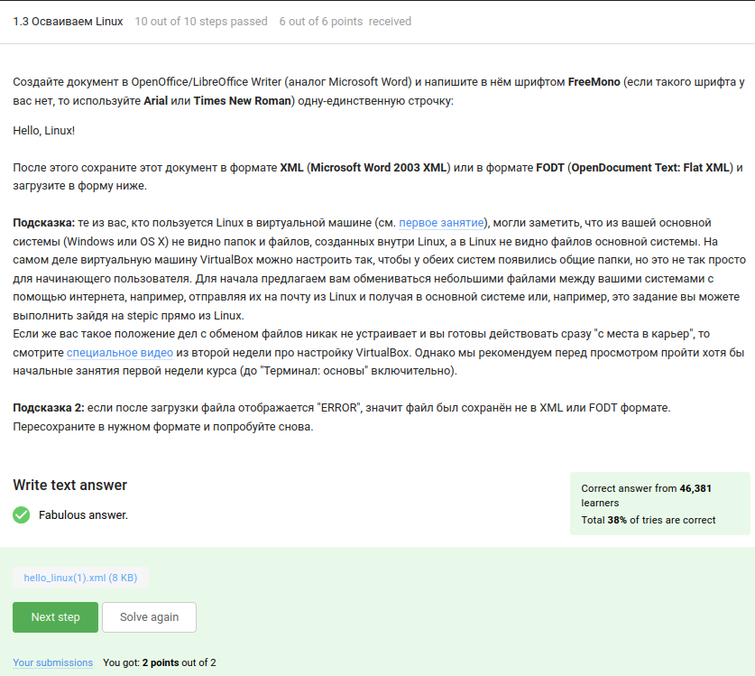
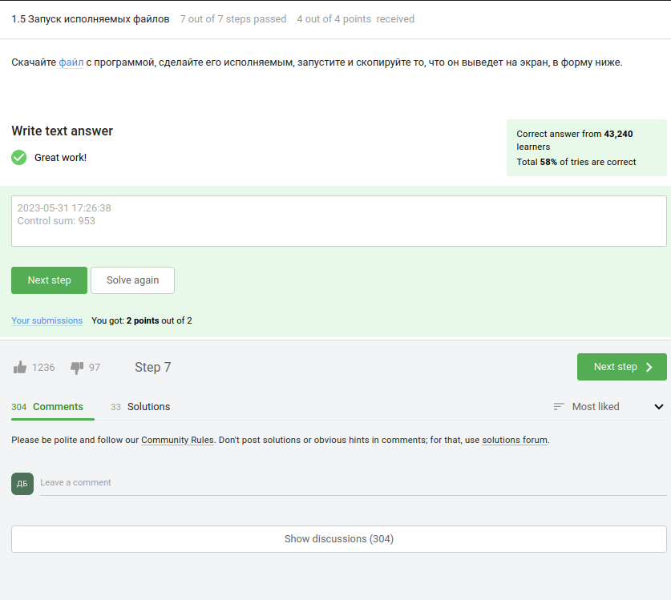
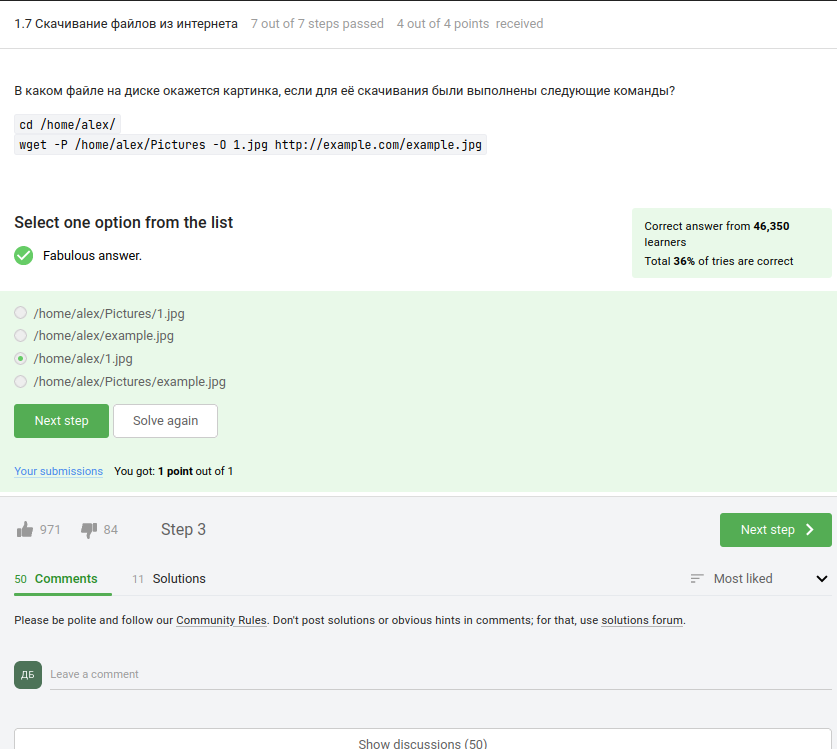

---
## Front matter
title: "Внешний курс Раздел 1. "
subtitle: "Введение"
author: "Боровиков Даниил Александрович"

## Generic otions
lang: ru-RU
toc-title: "Содержание"

## Bibliography
bibliography: bib/cite.bib
csl: pandoc/csl/gost-r-7-0-5-2008-numeric.csl

## Pdf output format
toc: true # Table of contents
toc-depth: 2
lof: true # List of figures
fontsize: 12pt
linestretch: 1.5
papersize: a4
documentclass: scrreprt
## I18n polyglossia
polyglossia-lang:
  name: russian
  options:
	- spelling=modern
	- babelshorthands=true
polyglossia-otherlangs:
  name: english
## I18n babel
babel-lang: russian
babel-otherlangs: english
## Fonts
mainfont: PT Serif
romanfont: PT Serif
sansfont: PT Sans
monofont: PT Mono
mainfontoptions: Ligatures=TeX
romanfontoptions: Ligatures=TeX
sansfontoptions: Ligatures=TeX,Scale=MatchLowercase
monofontoptions: Scale=MatchLowercase,Scale=0.9
## Biblatex
biblatex: true
biblio-style: "gost-numeric"
biblatexoptions:
  - parentracker=true
  - backend=biber
  - hyperref=auto
  - language=auto
  - autolang=other*
  - citestyle=gost-numeric
## Pandoc-crossref LaTeX customization
figureTitle: "Рис."
listingTitle: "Листинг"
lofTitle: "Список иллюстраций"
lotTitle: "Список таблиц"
lolTitle: "Листинги"
## Misc options
indent: true
header-includes:
  - \usepackage{indentfirst}
  - \usepackage{float} # keep figures where there are in the text
  - \floatplacement{figure}{H} # keep figures where there are in the text
---

# Цель работы

Познакомиться с операционной системой Linux и основами её использования. В рамках курса установить Linux на компьютер, познакомиться с программами в нем, поработать в терминале, зайти на удаленный сервер и рассмотреть еще несколько продвинутых тем. Стоит отметить, что курс не является исчерпывающим и рассказывает только о базовых возможностях Linux, но, несмотря на это, рассказанного материала достаточно для успешного выполнения разноплановых задач в системе Linux.

# Выполнение внешнего курса

Вопрос: как называется этот курс?(рис. @fig:001).

{#fig:001 width=100%}

Далее необходимо отметить все верные утверждения(рис. @fig:002).

{#fig:002 width=100%}

Вопрос: Какую операционную систему вы обычно используете? (рис. @fig:003).

{#fig:003 width=100%}

Вопрос: Что такое виртуальная машина? 

Виртуальная машина (Virtual Machine) - это программное обеспечение, которое эмулирует аппаратное обеспечение компьютера и позволяет запустить одну операционную систему внутри другой операционной системы.(рис. @fig:004).

{#fig:004 width=100%}

Вопрос: Смогли ли вы запустить на своем компьютере Linux?(рис. @fig:005).

{#fig:005 width=100%}

Задание: Создайте документ в OpenOffice/LibreOffice Writer (аналог Microsoft Word) и напишите в нём шрифтом FreeMono (если такого шрифта у вас нет, то используйте Arial или Times New Roman) одну-единственную строчку:

Hello, Linux!

После этого сохраните этот документ в формате XML (Microsoft Word 2003 XML) или в формате FODT (OpenDocument Text: Flat XML) и загрузите в форму ниже.(рис. @fig:006).

{#fig:006 width=100%}

При выполнении я повторил действия описанные в задании и отправил полученный документ.

Вопрос: Какое расширение имеют установочные пакеты в Linux (Ubuntu)?(рис. @fig:007).

{#fig:007 width=100%}

В установочных пакетах в Linux (Ubuntu) часто используется расширение ".deb". Расширение ".deb" обозначает формат пакета Debian, который является основой для многих дистрибутивов Linux, включая Ubuntu.

Пакеты с расширением ".deb" содержат установочные файлы, скрипты и метаданные, необходимые для установки и настройки программного обеспечения на системе Ubuntu. 

Задание: Поставьте себе в систему плеер VLC. Запустите, откройте Help → About (или Shift+F1) и напишите ниже первую фамилию (без имени!) из вкладки Authors. Обратите внимание, что в англоязычных текстах обычно имя стоит на первом месте (first name), а фамилия на втором (last name).(рис. @fig:008).

{#fig:008 width=100%}

Выполнив действия перечисленные в задании я вписал в строку ответ: Denis-Courmont.

Вопрос: Для чего можно использовать приложение Update Manager?(рис. @fig:009).

{#fig:009 width=100%}

Приложение Update Manager (Менеджер обновлений) в операционной системе Ubuntu (или других дистрибутивах Linux) предоставляет пользователю возможность управлять обновлениями системы и устанавливать последние версии программного обеспечения.

Вот несколько способов, как можно использовать приложение Update Manager:

1. Обновление системы: Update Manager предоставляет список доступных обновлений для операционной системы Ubuntu, включая безопасностные исправления, патчи и обновления приложений. Пользователь может использовать Update Manager для установки этих обновлений и поддержания системы в актуальном состоянии.

2. Установка новых версий программного обеспечения: Update Manager может также предложить обновленные версии установленных приложений. Он позволяет пользователю узнать о наличии новых версий программ и установить их с помощью нескольких кликов. Это помогает обновлять программы с новыми функциями и исправлениями ошибок.

3. Управление репозиториями: Update Manager позволяет настраивать и управлять источниками обновлений (репозиториями) в Ubuntu. Пользователь может добавлять новые репозитории, удалять ненужные или изменять приоритеты обновлений из различных источников.

4. Планирование автоматических обновлений: С помощью Update Manager можно настроить автоматическое обновление системы. Это позволяет системе самостоятельно загружать и устанавливать обновления в фоновом режиме без участия пользователя.

Update Manager облегчает процесс управления обновлениями и обновлений программного обеспечения в Ubuntu, помогая поддерживать систему безопасной, стабильной и актуальной.

Вопрос: Выберите все синонимы для “командной строки”.(рис. @fig:010).

{#fig:010 width=100%}

Синонимы для "командной строки":

1. Терминал
2. Консоль
3. Командный интерфейс
4. CLI (Command Line Interface)
5. Командный процессор
6. Командный шелл
7. Консольное окно

Эти термины обычно используются в контексте работы с операционной системой через текстовый интерфейс, где пользователь может вводить команды и получать соответствующие ответы и результаты.

Вопрос: Какая команда напечатает в какой директории мы сейчас находимся?(рис. @fig:011).

{#fig:011 width=100%}

Верная команда, которая позволяет узнать текущую директорию, называется pwd. Она выводит полный путь (абсолютный путь) к текущей рабочей директории, в которой вы находитесь в данный момент.

Вопрос: Укажите, какие из следующих команд полностью эквивалентны команде ls -A --human-readable -l /some/directory(рис. @fig:012).

{#fig:012 width=100%}

Все эти команды выполняют аналогичные действия: выводят содержимое директории /some/directory, включая скрытые файлы (-A или --almost-all), с подробным форматированным выводом (-l), в удобочитаемом формате для размеров файлов (--human-readable).

Вопрос: Предположим, что вы находитесь в директории /home/bi/Documents, причем /home/bi — ваша домашняя директория. Какая(ие) команда выведет содержимое /home/bi/Downloads, при этом не показывая содержимое других директорий?(рис. @fig:013).

{#fig:013 width=100%}

В данном случае все предложенные команды выведут содержимое директории `/home/bi/Downloads` без отображения содержимого других директорий. Давайте рассмотрим каждую команду по отдельности и объясним, почему они верны:

1. `ls ./../Downloads`: Две точки `./..` в данной команде означают родительскую директорию текущей директории. Таким образом, команда `ls ./../Downloads` переходит в родительскую директорию (`/home/bi`) и затем выводит содержимое директории `Downloads`.

2. `ls ~/Downloads`: Тильда `~` в Linux обозначает домашнюю директорию пользователя. В данном случае, `~/Downloads` указывает на путь `/home/bi/Downloads`. Таким образом, команда `ls ~/Downloads` выводит содержимое директории `Downloads` в домашней директории пользователя.

3. `ls ../Downloads`: Две точки `..` в данной команде означают родительскую директорию текущей директории. Команда `ls ../Downloads` переходит в родительскую директорию текущей директории (`/home/bi/Documents`) и затем выводит содержимое директории `Downloads`.

4. `ls /home/bi/Downloads`: Эта команда явно указывает полный путь к директории `Downloads`, начиная с корневой директории. Таким образом, команда `ls /home/bi/Downloads` выводит содержимое директории `Downloads` без зависимости от текущей директории, в которой вы находитесь.

Все эти команды будут эквивалентными в данном контексте и выведут содержимое директории `/home/bi/Downloads`, не показывая содержимого других директорий.

Вопрос: Какая команда используется для удаления директорий?(рис. @fig:014).

{#fig:014 width=100%}

Команда, используемая для удаления директорий, это rm -r.

При использовании команды rm -r, rm означает "удалить", а -r указывает на рекурсивное удаление. Рекурсивное удаление директории включает удаление всех файлов и поддиректорий внутри нее.

Вопрос: Что произойдет, если ввести в терминал команду firefox, а затем ввести туда же команду exit?(рис. @fig:015).

{#fig:015 width=100%}

Если вы запустите браузер Firefox, введя команду "firefox" в терминале, и затем в этом же терминале введете команду "exit", то никто из двух - ни Firefox, ни терминал - не закроется.

Команда "exit" в терминале используется для выхода из текущего сеанса терминала. Она завершает текущую оболочку командной строки (например, Bash) и закрывает терминальное окно, но не влияет на работу других запущенных программ.

Поэтому, если вы запустили Firefox из терминала и ввели "exit", то только сеанс терминала завершится, а Firefox продолжит работу в своем окне. Вы сможете продолжать использовать браузер Firefox независимо от закрытия терминала.

Вопрос: Чему эквивалентен запуска программы с &?(рис. @fig:016).

{#fig:016 width=100%}

Запуск программы с использованием символа "&" означает выполнение программы в фоновом режиме. Это позволяет запустить программу и продолжить работать в терминале без ожидания завершения выполнения программы.

Таким образом, правильный вариант будет:

Запуск, Ctrl+Z, bg

Задание: Скачайте файл с программой, сделайте его исполняемым, запустите и скопируйте то, что он выведет на экран, в форму ниже.(рис. @fig:017).

{#fig:017 width=100%}

При запуске данной программы на экран будет выведено текущее время в формате "год-месяц-день час:минута:секунда", а затем будет выведена контрольная сумма этого времени.

Вопрос: Куда по умолчанию выводится поток ошибок из программы, запущенной в терминале?(рис. @fig:018).

{#fig:018 width=100%}

По умолчанию, поток ошибок (stderr) из программы, запущенной в терминале, выводится на экран. Это означает, что сообщения об ошибках и другая отладочная информация будет отображаться непосредственно в терминале, где была запущена программа.

Вопрос: Какие (какая) из команд создадут файл file.txt и запишут в него поток ошибок программы program? Считайте, что в момент запуска программы файл file.txt не существует.(рис. @fig:019).

{#fig:019 width=100%}

Из предложенных команд, следующие создадут файл `file.txt` и запишут в него поток ошибок программы `program`:

1. `program 2>> file.txt` - Эта команда создаст файл `file.txt`, если он не существует, и добавит содержимое потока ошибок программы `program` в конец файла `file.txt`. Если файл уже существует, новые данные будут добавлены в конец файла без удаления существующего содержимого.

2. `program 2> file.txt` - Эта команда создаст файл `file.txt`, если он не существует, и перенаправит содержимое потока ошибок программы `program` в файл `file.txt`. Если файл уже существует, он будет перезаписан, и содержимое будет заменено новыми данными.

Обратите внимание, что оператор `2>` используется для перенаправления потока ошибок (stderr). Оператор `>` без указания числа (например, `> file.txt`) перенаправляет стандартный вывод (stdout).

Остальные команды из предложенного списка не создадут файл `file.txt` и не запишут в него поток ошибок программы `program`.

Вопрос: Куда деваются сообщения об ошибках (т.е. вывод в stderr) от тех программ, которые объединены в конвейер (pipe)?(рис. @fig:020).

{#fig:020 width=100%}

При объединении программ в конвейер (pipe) в Unix-подобных системах, сообщения об ошибках (stderr) из каждой программы по умолчанию не сохраняются или перенаправляются. Они продолжают выводиться на экран.

Вопрос: В каком файле на диске окажется картинка, если для её скачивания были выполнены следующие команды?

cd /home/alex/
wget -P /home/alex/Pictures -O 1.jpg http://example.com/example.jpg(рис. @fig:021).

{#fig:021 width=100%}

Картинка окажется в файле /home/alex/Pictures/1.jpg.

Объяснение:

cd /home/alex/ - эта команда переходит в директорию /home/alex/.
wget -P /home/alex/Pictures -O 1.jpg http://example.com/example.jpg - данная команда использует утилиту wget для скачивания файла http://example.com/example.jpg. Опция -P /home/alex/Pictures указывает, что файл должен быть сохранен в директории /home/alex/Pictures, а опция -O 1.jpg задает имя файла как 1.jpg.
Таким образом, файл будет сохранен с именем 1.jpg в директории /home/alex/Pictures.

Вопрос: Какую опцию нужно указать команде wget, чтобы она не выводила никаких сообщений на экран (Resolving.., Connecting to.. и т.д.)?(рис. @fig:022).

{#fig:022 width=100%}

Опцию, которую нужно указать команде wget, чтобы она не выводила никаких сообщений на экран, включая сообщения о разрешении и установке соединения, является -q или --quiet. 

Вопрос: Пусть на некоторой web-странице есть ссылки на картинки в форматах png и jpg, а также ссылки на другие страницы сайта (обычные html файлы). Какие файлы будут скачаны на компьютер, если запустить wget -r -l 1 -A jpg и передать в качестве аргумента ссылку на эту web-страницу? Выберите наиболее полный ответ!(рис. @fig:023).

{#fig:023 width=100%}

Если запустить команду `wget -r -l 1 -A jpg` и передать в качестве аргумента ссылку на web-страницу, то будут скачаны jpg и html файлы, но все html файлы будут удалены.

Опции в команде `wget` имеют следующие значения:

- `-r` указывает `wget` на рекурсивное скачивание, чтобы обрабатывать ссылки на другие страницы.
- `-l 1` ограничивает уровень рекурсии на глубину 1, что означает, что `wget` будет скачивать только ссылки на страницы, непосредственно связанные с исходной страницей.
- `-A jpg` указывает `wget` скачивать только файлы с расширением jpg.

Следовательно, при использовании указанных опций и передаче ссылки на web-страницу, `wget` будет скачивать только jpg и html файлы. Однако, все скачанные html файлы будут удалены, так как не указана опция для их сохранения.

Вопрос: Чем отличаются архиваторы gzip и zip?(рис. @fig:024).

{#fig:024 width=100%}

Отличие между архиваторами gzip и zip заключается в их форматах архивации и функциональности:

1. Формат архивации: gzip использует формат сжатия данных без потерь, известный как gzip, в то время как zip использует формат архивации, который может включать в себя сжатие без потерь или сжатие с потерями для определенных типов файлов (например, изображений).

2. Функциональность: gzip обычно используется для сжатия одного файла или потока данных, в то время как zip может сжимать и архивировать несколько файлов и директорий в один архив.

Относительно утверждений:

- Нет однозначного ответа на вопрос о том, какой архиватор (gzip или zip) сжимает лучше, так как это зависит от типа данных и настроек сжатия. В общем случае, gzip обеспечивает лучшую степень сжатия для текстовых файлов, в то время как zip может быть более эффективным для архивации разнообразных типов файлов, включая изображения и другие бинарные файлы.

- Утверждение о том, что gzip удаляет архив после его распаковки, не является верным. Архиватор gzip не автоматически удаляет исходный архив после распаковки. Это зависит от специфической команды или скрипта, который вызывается для распаковки архива.

Вопрос: Какие из перечисленных программ-архиваторов могут создать архив из директории с файлами?(рис. @fig:025).

{#fig:025 width=100%}

Из перечисленных программ-архиваторов, tar и zip могут создать архивы из директории с файлами.

tar - это утилита для создания архивов, которая может работать с директориями и файлами. Она может создавать архивы из одной или нескольких директорий, а также сохранять различные метаданные, такие как права доступа и временные метки файлов.

zip - это утилита для создания архивов, которая также может работать с директориями и файлами. Она позволяет создавать архивы из одной или нескольких директорий, поддерживает сжатие файлов и сохраняет структуру директорий в архиве.

gzip, с другой стороны, является утилитой для сжатия и разжатия файлов, но она не предоставляет функциональности для создания архивов из директорий. Она работает только с отдельными файлами и не сохраняет информацию о структуре директорий.

Таким образом, для создания архива из директории с файлами, можно использовать tar или zip.

Вопрос: Какой набор опций нужно указать программе tar, чтобы запаковать файлы в my_archive.tar.bz2?(рис. @fig:026).

{#fig:026 width=100%}

Для запаковки файлов в архив my_archive.tar.bz2 с использованием программы tar, необходимо указать набор опций -cjf.

Объяснение:

-c указывает tar на создание нового архива.
-j указывает tar использовать алгоритм сжатия Bzip2.
-f указывает tar имя файла, куда будет сохранен архив.

Задание: Откройте терминал нажатием "Open Terminal"
Скачайте в нем архив https://stepik.org/media/attachments/course73/quiz_archive.tar.gz в директорию /home/box (для этого вам пригодится команда wget, см. предыдущее занятие).
Распакуйте этот архив с использованием ровно одной команды терминала.
Нажмите кнопку "Submit".(рис. @fig:027).

{#fig:027 width=100%}

Команда: wget -P /home/box https://stepik.org/media/attachments/course73/quiz_archive.tar.gz tar -xzf quiz_archive.tar.gz 

Вопрос: Какая маска команды find НЕ найдет файл Alexey.jpeg?(рис. @fig:028).

{#fig:028 width=100%}

Среди предложенных вариантов масок команды `find`, три из них не найдут файл `Alexey.jpeg`:

1. `*.?` - Эта маска ищет все файлы, у которых расширение состоит из одного символа. Таким образом, она не найдет файл `Alexey.jpeg`, так как его расширение состоит из пяти символов (`jpeg`).

2. `*.jpg` - Эта маска ищет все файлы с расширением `jpg`. Так как файл `Alexey.jpeg` имеет расширение `jpeg`, она не будет найдена.

3. `alexey.*` - Эта маска ищет все файлы с именем `alexey` и любым расширением. Так как имя файла `Alexey.jpeg` отличается от `alexey` по регистру, он не будет найден.

Варианты, которые найдут файл `Alexey.jpeg`:

- `Alex*` - Эта маска ищет все файлы, начинающиеся с `Alex`, включая `Alexey.jpeg`, так как имя файла начинается с `Alex`.

- `*.*` - Эта маска ищет все файлы с расширением, включая `Alexey.jpeg`, так как у него есть точка и расширение.

Вопрос: Предположим, что в файле  text.txt записаны строки, показанные среди вариантов ответа. Отметьте только те из них, которые выведет на экран команда  grep "world" text.txt.(рис. @fig:029).

{#fig:029 width=100%}

Для вывода на экран только строк, содержащих слово "world", команда `grep "world" text.txt` выведет следующие строки:

- world
- The beautiful-world is not enough
- The "world" is not enough
- The beautifulworld is not enough
- The world is not enough

Таким образом, строки, которые будут выведены на экран командой `grep "world" text.txt`, это:

- world
- The beautiful-world is not enough
- The "world" is not enough
- The beautifulworld is not enough
- The world is not enough

Задание: Cкачайте архив с произведениями Шекспира. Вам нужно сгенерировать файл, в котором будут все строчки из этих произведений, содержащие “love”, и загрузить этот файл в форму.(рис. @fig:030).

{#fig:030 width=100%}

Команды: 

wget https://stepik.org/media/attachments/course73/shakespeare.tar.gz

tar -xzf shakespeare.tar.gz

grep -r "love" Shakespeare >> ans.txt

# Вывод

В ходе лабораторной работы мы познакомились с операционной системой Linux и основами её использования. В рамках курса установили Linux на компьютер, познакомились с программами в нем, поработали в терминале, зайшли на удаленный сервер и рассмотрели еще несколько продвинутых тем. Стоит отметить, что курс не является исчерпывающим и рассказывает только о базовых возможностях Linux, но, несмотря на это, рассказанного материала достаточно для успешного выполнения разноплановых задач в системе Linux.
