---
## Front matter
title: "Внешний курс Раздел 2. "
subtitle: "Работа с серверм"
author: "Боровиков Даниил Александрович"

## Generic otions
lang: ru-RU
toc-title: "Содержание"

## Bibliography
bibliography: bib/cite.bib
csl: pandoc/csl/gost-r-7-0-5-2008-numeric.csl

## Pdf output format
toc: true # Table of contents
toc-depth: 2
lof: true # List of figures
fontsize: 12pt
linestretch: 1.5
papersize: a4
documentclass: scrreprt
## I18n polyglossia
polyglossia-lang:
  name: russian
  options:
	- spelling=modern
	- babelshorthands=true
polyglossia-otherlangs:
  name: english
## I18n babel
babel-lang: russian
babel-otherlangs: english
## Fonts
mainfont: PT Serif
romanfont: PT Serif
sansfont: PT Sans
monofont: PT Mono
mainfontoptions: Ligatures=TeX
romanfontoptions: Ligatures=TeX
sansfontoptions: Ligatures=TeX,Scale=MatchLowercase
monofontoptions: Scale=MatchLowercase,Scale=0.9
## Biblatex
biblatex: true
biblio-style: "gost-numeric"
biblatexoptions:
  - parentracker=true
  - backend=biber
  - hyperref=auto
  - language=auto
  - autolang=other*
  - citestyle=gost-numeric
## Pandoc-crossref LaTeX customization
figureTitle: "Рис."
listingTitle: "Листинг"
lofTitle: "Список иллюстраций"
lotTitle: "Список таблиц"
lolTitle: "Листинги"
## Misc options
indent: true
header-includes:
  - \usepackage{indentfirst}
  - \usepackage{float} # keep figures where there are in the text
  - \floatplacement{figure}{H} # keep figures where there are in the text
---
# Цель работы

Познакомиться с операционной системой Linux и основами её использования. В рамках курса установить Linux на компьютер, познакомиться с программами в нем, поработать в терминале, зайти на удаленный сервер и рассмотреть еще несколько продвинутых тем. Стоит отметить, что курс не является исчерпывающим и рассказывает только о базовых возможностях Linux, но, несмотря на это, рассказанного материала достаточно для успешного выполнения разноплановых задач в системе Linux.

# Выполнение внешнего курса

Вопрос: Для каких задач можно использовать удаленный сервер?(рис. @fig:001).

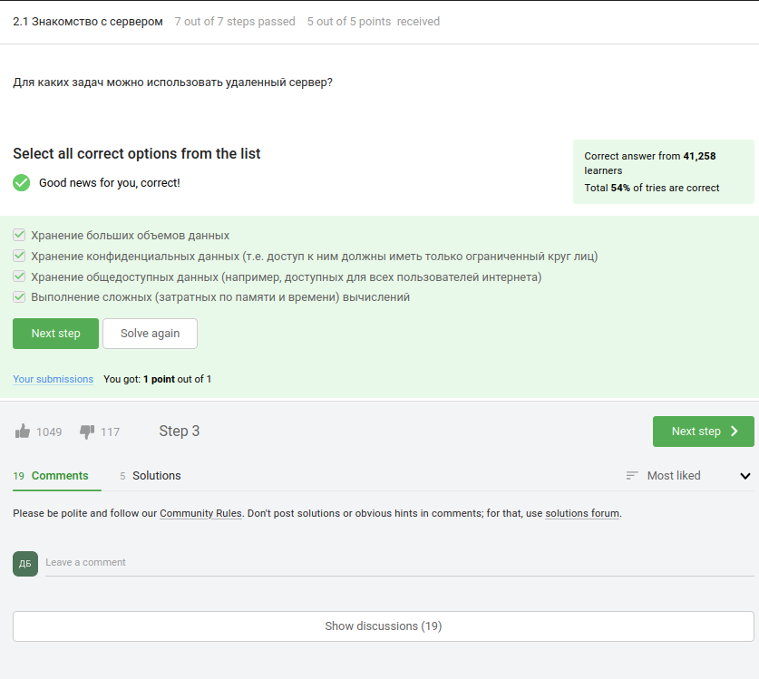{#fig:001 width=100%}

Удаленный сервер может использоваться для различных задач. Ниже приведены примеры задач, для которых может быть полезно использовать удаленный сервер:

1. Хранение больших объемов данных: Удаленные серверы могут предоставлять большой объем хранилища для хранения и обработки данных. Это может быть полезно, например, для хранения архивов, резервных копий или других объемных наборов данных.

2. Хранение конфиденциальных данных: Удаленные серверы могут предоставлять защищенное хранилище для конфиденциальных данных. Это может включать данные, требующие высокого уровня безопасности, такие как личные данные клиентов, медицинские записи или корпоративные секреты. Удаленные серверы могут обеспечивать контроль доступа и шифрование данных для обеспечения безопасности.

3. Хранение общедоступных данных: Удаленные серверы могут использоваться для хранения и предоставления общедоступных данных. Это может включать публичные веб-сайты, файловые хранилища, стриминговые сервисы и другие ресурсы, доступные для всех пользователей интернета.

4. Выполнение сложных вычислений: Удаленные серверы могут использоваться для выполнения вычислительно интенсивных задач. Это может быть полезно, когда требуется большой объем памяти или высокая вычислительная мощность, например, для научных расчетов, моделирования, анализа данных или машинного обучения.

Удаленные серверы предоставляют гибкость и мощность вычислений, а также возможность централизованного управления и доступа к ресурсам, что делает их полезными для различных задач в зависимости от требований пользователя.

Вопрос: Предположим программа ssh-keygen создала вам два ключа: id_rsa и id_rsa.pub. Какой из этих ключей можно без опаски пересылать по интернету?(рис. @fig:002).

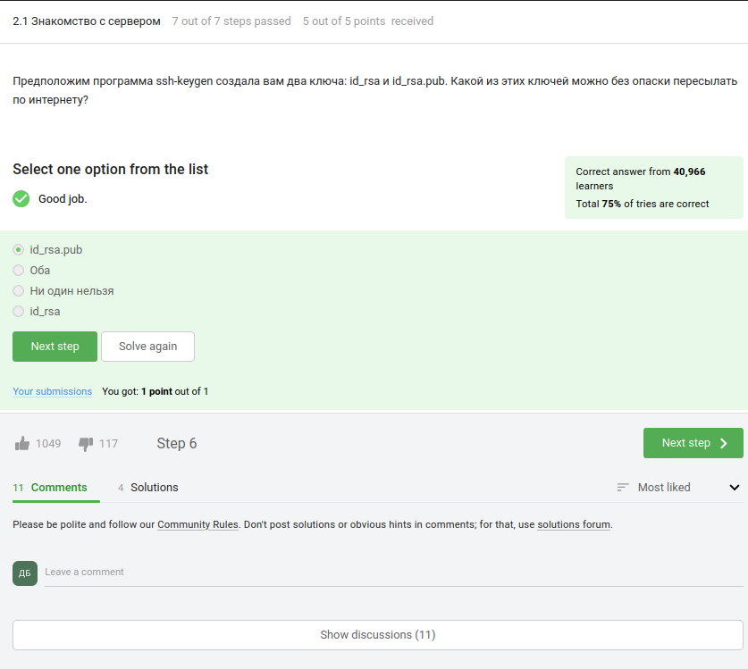{#fig:002 width=100%}

Ключ, который можно без опаски пересылать по интернету, - это id_rsa.pub.

Ключ id_rsa.pub является открытым ключом, который используется для аутентификации при подключении к удаленному серверу с помощью протокола SSH. Открытый ключ можно безопасно распространять и передавать по интернету. Он не содержит конфиденциальной информации и не может использоваться для получения несанкционированного доступа к вашей системе. Открытый ключ id_rsa.pub обычно добавляется на удаленный сервер в файл ~/.ssh/authorized_keys, чтобы разрешить вам подключаться к серверу с использованием соответствующего закрытого ключа.

Задание: Для начала выполнения нажмите кнопку "Open Terminal". Открывшийся в браузере терминал будем называть "локальный". Зайдите с этого терминала по SSH на удаленный сервер server1.stepik-local. Для доступа к серверу используйте логин box и пароль supersecret, а порт указывать не нужно -- используется порт по умолчанию. Прочитайте содержимое файла /srv/files_on_server/secret на удалённом сервере и запишите его в локальный файл /home/box/secret (т.е. вам нужно будет выйти с сервера!). Для записи данных в файл воспользуйтесь командой:

echo "SECRET TEXT" > /home/box/secret

где вместо SECRET TEXT нужно указать текст из заданного файла.(рис. @fig:003).

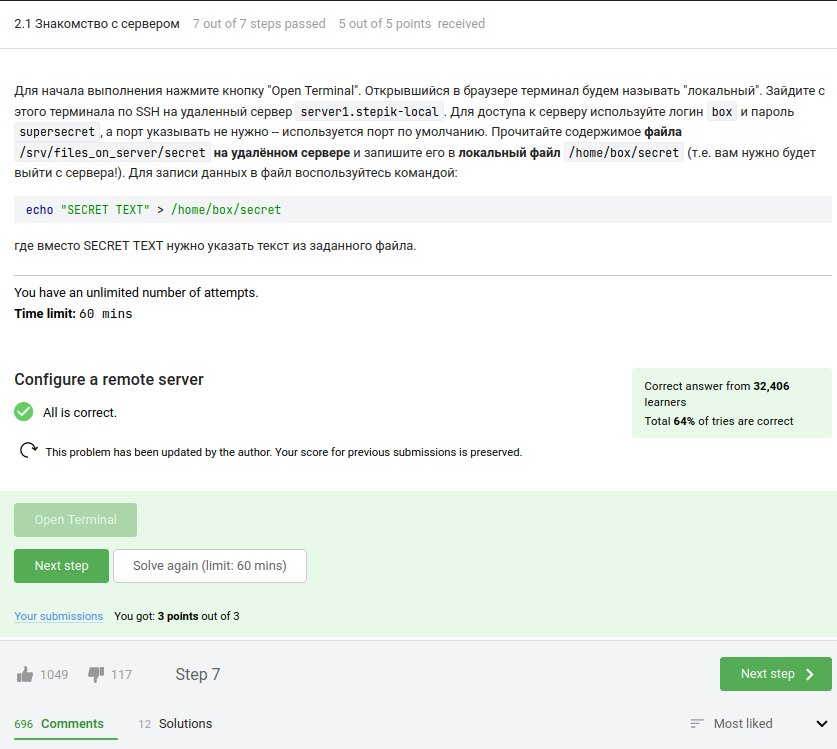{#fig:003 width=100%}

Ход действий:

1. В терминале прописываем : ssh server1.stepik-local

2. Прописываем: cat /srv/files_on_server/secret
 появится надпись. Копируем её.

3. Прописываем: exit

4. Прописываем: echo "I hacked ssh" > /home/box/secret

Вопрос: Какая команда скопирует на сервер (в домашнюю директорию) папку stepic вместе с содержимым ее самой и всех ее подпапок?(рис. @fig:004).

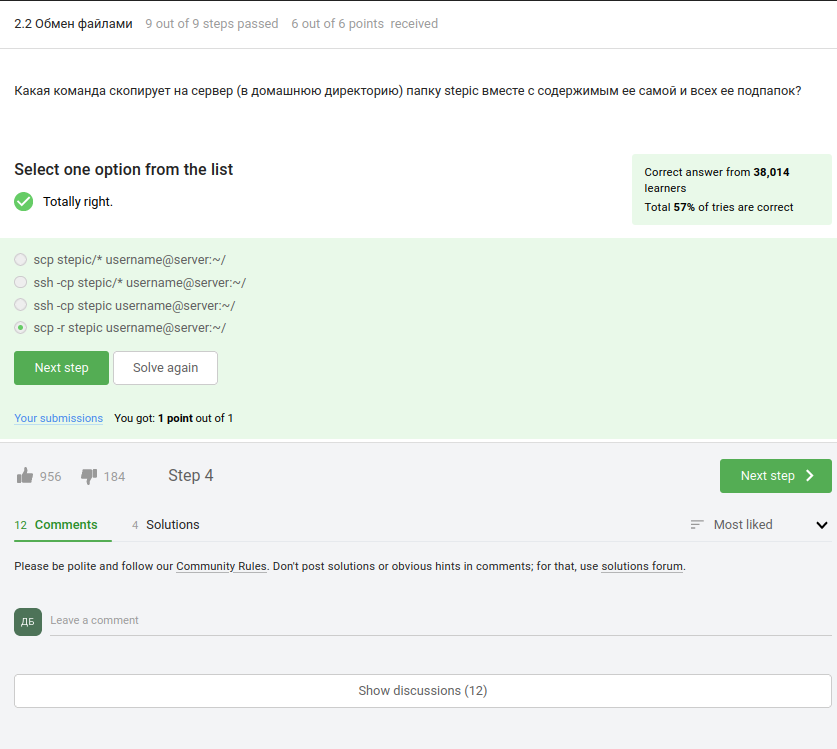{#fig:004 width=100%}

Команда, которая скопирует папку "stepic" вместе с содержимым и всеми подпапками на удаленный сервер в его домашнюю директорию, это:

scp -r stepic username@server:~/

Опция "-r" указывает на рекурсивное копирование, то есть она включает все файлы и подпапки внутри папки "stepic". Далее следует указание имени пользователя и адреса удаленного сервера, а затем путь до целевой директории на сервере, в данном случае "~/" означает домашнюю директорию пользователя на сервере.

Таким образом, команда scp выше скопирует папку "stepic" и ее содержимое на удаленный сервер в его домашнюю директорию.

Вопрос: Предположим, что вы устанавливаете программу program на свой компьютер при помощи команды sudo apt-get install program. Терминал сообщает вам, что он не может найти и скачать установочный пакет. Какие действия могут устранить проблему?(рис. @fig:005).

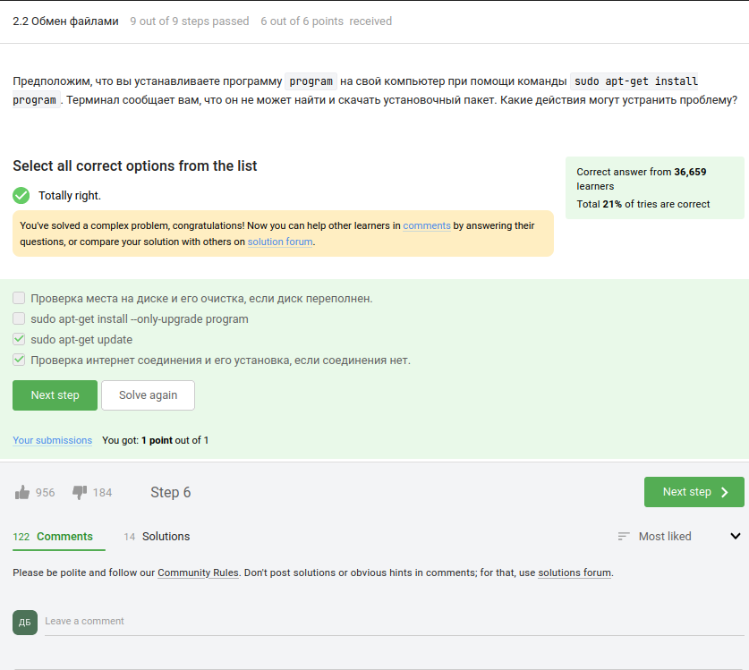{#fig:005 width=100%}

Действия, которые могут устранить проблему с невозможностью найти и скачать установочный пакет при использовании команды `sudo apt-get install program`, это:

1. Проверка интернет-соединения и его установка, если соединение отсутствует: Убедитесь, что у вас есть активное и работоспособное интернет-соединение. Проверьте свои сетевые настройки и убедитесь, что вы можете подключиться к интернету.

2. Обновление списка пакетов: Выполните команду `sudo apt-get update`, чтобы обновить список доступных пакетов в вашем репозитории. Это обновит информацию о доступных пакетах и их местонахождении.

Таким образом, верными ответами будут "sudo apt-get update" и "Проверка интернет соединения и его установка, если соединения нет".

Вопрос: Для чего можно использовать программу Filezilla?(рис. @fig:006).

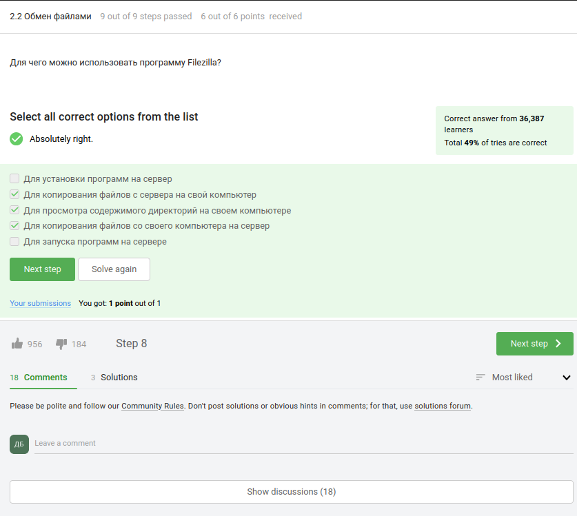{#fig:006 width=100%}

Программа Filezilla - это клиент FTP (File Transfer Protocol), который предназначен для управления передачей файлов между клиентом (в данном случае вашим компьютером) и сервером. Верными ответами на вопрос "Для чего можно использовать программу Filezilla?" будут следующие:

1. Для копирования файлов с сервера на свой компьютер: Filezilla позволяет устанавливать соединение с удаленным FTP-сервером и копировать файлы с сервера на ваш компьютер. Вы можете просматривать содержимое сервера, выбирать файлы и каталоги для загрузки на локальный компьютер.

2. Для копирования файлов со своего компьютера на сервер: Filezilla также позволяет загружать файлы с вашего компьютера на удаленный FTP-сервер. Вы можете выбирать файлы и каталоги на локальном компьютере и отправлять их на сервер.

Таким образом, Filezilla является полезным инструментом для управления передачей файлов между компьютером и сервером, как для загрузки файлов с сервера на компьютер, так и для загрузки файлов с компьютера на сервер.

Задание: Для начала выполнения нажмите кнопку "Open Terminal". Открывшийся в браузере терминал будем называть "локальный". Скопируйте при помощи SCP с удаленного сервера server1.stepik-local все файлы из директории /srv/files_on_server/ в локальную директорию /home/box/files_on_client/ (её нужно будет еще создать!). Для доступа к серверу используйте логин box и пароль supersecret, а порт указывать не нужно -- используется порт по умолчанию.(рис. @fig:007).

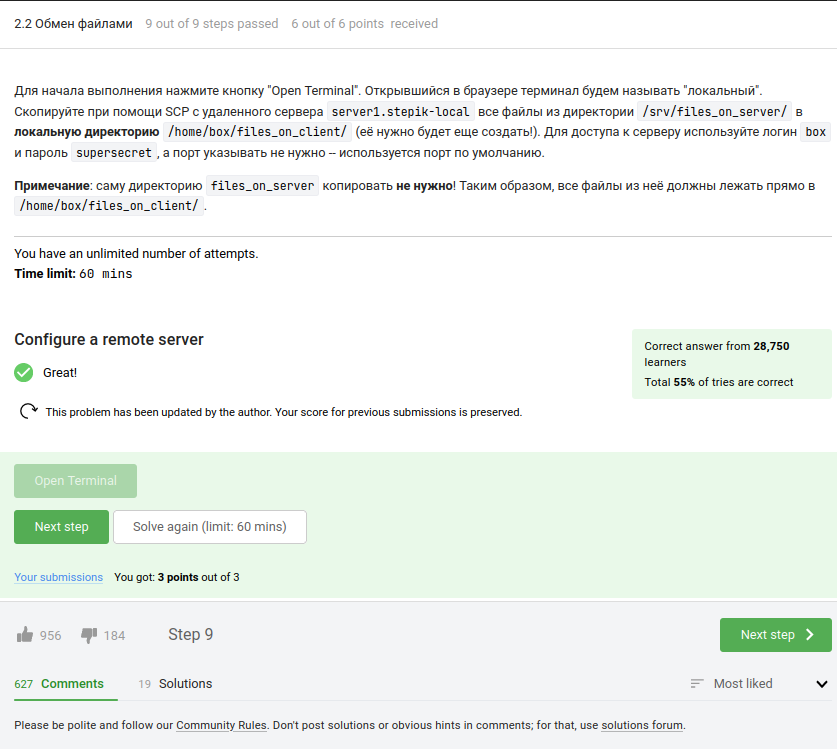{#fig:007 width=100%}

Команды:

mkdir files_on_client

scp -r box@server1.stepik-local:/srv/files_on_server/* /home/box/files_on_client/

Вопрос: Что можно сделать, если требуется запустить на сервере программу, для работы которой нужен не терминал, а экран?(рис. @fig:008).

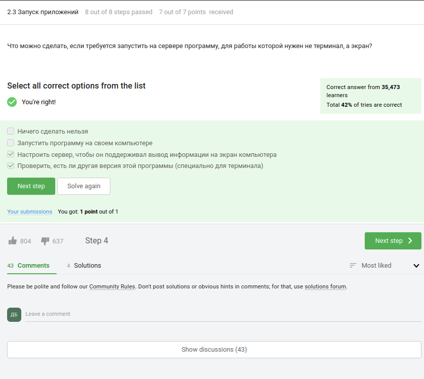{#fig:008 width=100%}

Если требуется запустить на сервере программу, для работы которой нужен не терминал, а экран, возможны следующие действия:

1. Настроить сервер, чтобы он поддерживал вывод информации на экран компьютера: Для этого требуется настроить удаленный доступ к графическому интерфейсу сервера, например, при использовании протокола VNC (Virtual Network Computing) или подобных технологий. Это позволит вам получить доступ к графическому рабочему окружению сервера и запускать программы, которые требуют визуального вывода.

2. Проверить, есть ли другая версия программы, специально предназначенная для работы в терминале: Некоторые программы имеют версии, которые разработаны для работы в терминальном режиме, без использования графического интерфейса. Если доступ к графическому интерфейсу недоступен, можно проверить, существуют ли альтернативные версии программы, которые можно использовать в терминале.

Таким образом, верными ответами на вопрос будут "Настроить сервер, чтобы он поддерживал вывод информации на экран компьютера" и "Проверить, есть ли другая версия этой программы, специально для терминала".

Вопрос: Как обычно можно вызвать справочную информацию о программе program?(рис. @fig:009).

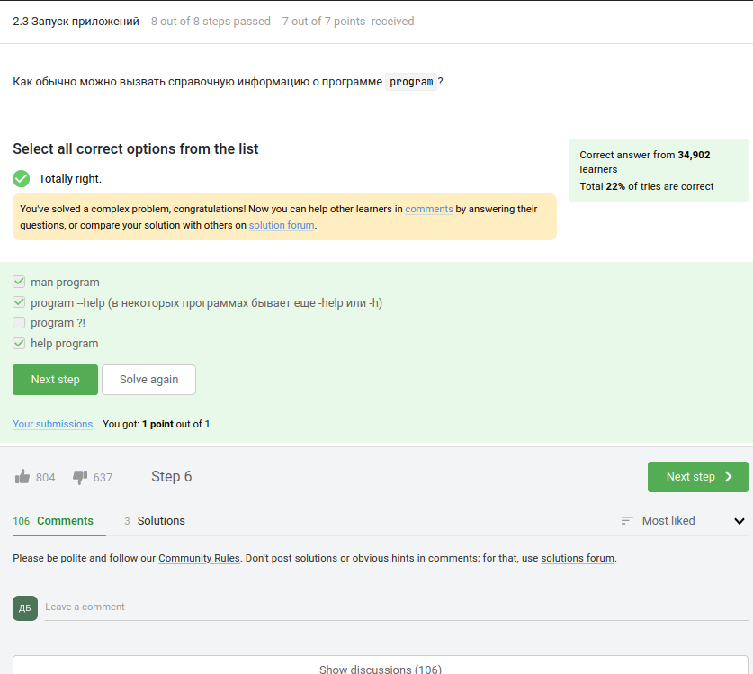{#fig:009 width=100%}

Обычно для вызова справочной информации о программе "program" используются следующие способы:

1. `man program`: Команда `man` (сокращение от "manual") позволяет получить справку о программе через терминал. Выполнение команды `man program` открывает справочное руководство, содержащее подробную информацию о программе "program".

2. `program --help` (или `-help` или `-h`): Многие программы поддерживают параметр `--help` (или его вариации), который выводит краткую справочную информацию о программе и доступных ей параметрах. Запуск команды `program --help` покажет справочную информацию о программе "program".

3. `help program`: В интерактивной оболочке, такой как командная строка или оболочка Bash, можно использовать команду `help program`. Эта команда предоставляет справочную информацию о встроенных командах оболочки и некоторых других утилитах.

Верными ответами на вопрос будут `man program`, `program --help (или -help или -h)` и `help program`.

Вопрос: Посмотрите справку по программе FastQC (имеется ввиду вариант для запуска в терминале) и определите, какие форматы данных он может принимать на вход.(рис. @fig:010).

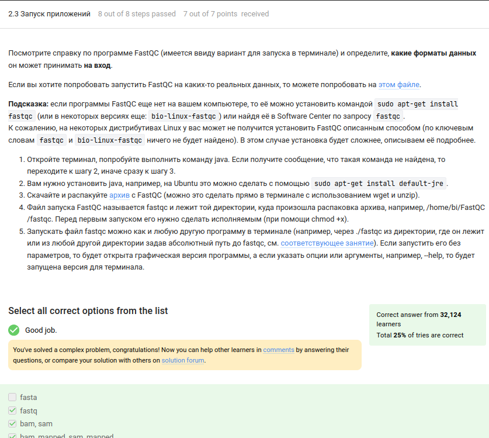{#fig:010 width=100%}

FastQ (fastq): Это самый распространенный формат данных секвенирования и содержит последовательности нуклеотидов и соответствующие им качественные значения.

BAM (bam): Формат BAM является сжатой и индексированной версией формата SAM (Sequence Alignment/Map) и содержит информацию о выравнивании секвенаторных данных на определенный референсный геном.

SAM (sam): Формат SAM используется для хранения результатов выравнивания секвенаторных данных на определенный референсный геном. Он содержит информацию о выравнивании и дополнительные метаданные.

Форматы "bam_mapped" и "sam_mapped" не являются стандартными форматами данных для FastQC.

Вопрос: Clustal -- это одна из самых широко используемых компьютерных программ для множественного выравнивания нуклеотидных и аминокислотных последовательностей (multiple sequence alignment). У нее есть графическая версия ClustalX и версия для запуска в терминале ClustalW. Вы можете потренироваться запускать его с использованием файла test.fasta.

Посмотрите справку по программе (имеется в виду версия для терминала) и впишите в поле ниже команду, которая запускает в терминале Clustal на файле test.fasta и выполняет множественное выравнивание (multiple alignment). Никакие лишние опции указывать не нужно (только необходимые для выполнения этого задания)(рис. @fig:011).

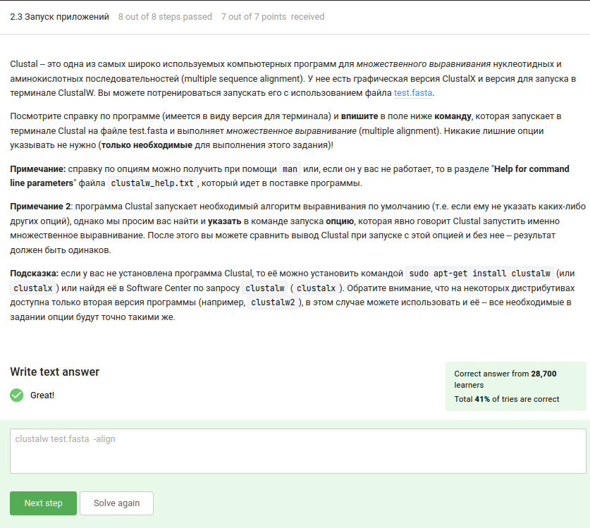{#fig:011 width=100%}

Прочитав мануал вводим ответ: 

clustalw test.fasta  -align

Вопрос: Предположим вы запустили программы program1, program2 и program3 в фоновом режиме. После этого вы выполнили следующие действия:

fg %1

Ctrl+С

fg %2

Ctrl+Z

jobs

Информация о каких программах будет показана при выполнении команды jobs?(рис. @fig:012).

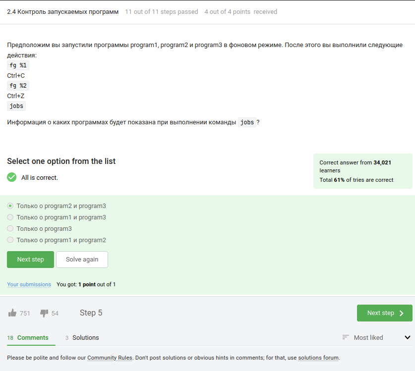{#fig:012 width=100%}

При выполнении команды jobs будет показана информация о программе, запущенной в фоновом режиме. В данном случае, после выполнения указанных действий, информация о программе program1 будет отсутствовать, так как она была прервана с помощью комбинации клавиш Ctrl+C. Остальные программы program2 и program3 будут продолжать выполняться в фоновом режиме, поэтому информация о них будет показана при выполнении команды jobs.

Таким образом, правильный ответ: Только о program2 и program3.

Вопрос: jobs, top и ps позволяют отслеживать работу запущенных в терминале программ. В каждой из этих трех утилит для каждой запущенной программы указывается число-идентификатор. Одинаковые ли эти идентификаторы в  jobs, top и ps?(рис. @fig:013).

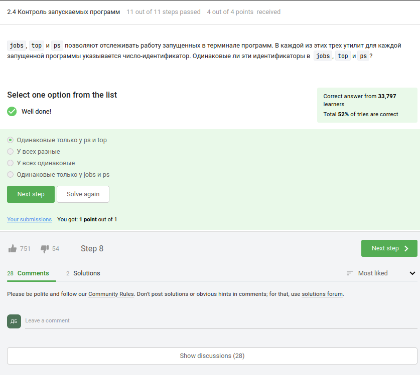{#fig:013 width=100%}

Одинаковые идентификаторы используются только между утилитами `top` и `ps`. Команда `top` и утилита `ps` предоставляют информацию о запущенных процессах в системе, и идентификаторы процессов в этих утилитах будут совпадать.

Однако команда `jobs` отображает информацию о задачах, запущенных внутри текущего интерактивного сеанса оболочки (shell), и идентификаторы задач в `jobs` могут отличаться от идентификаторов процессов, используемых в `top` и `ps`.

Таким образом, правильный ответ: Одинаковые только у ps и top.

Вопрос: С помощью какой команды можно мгновенно завершить остановленный процесс?(рис. @fig:014).

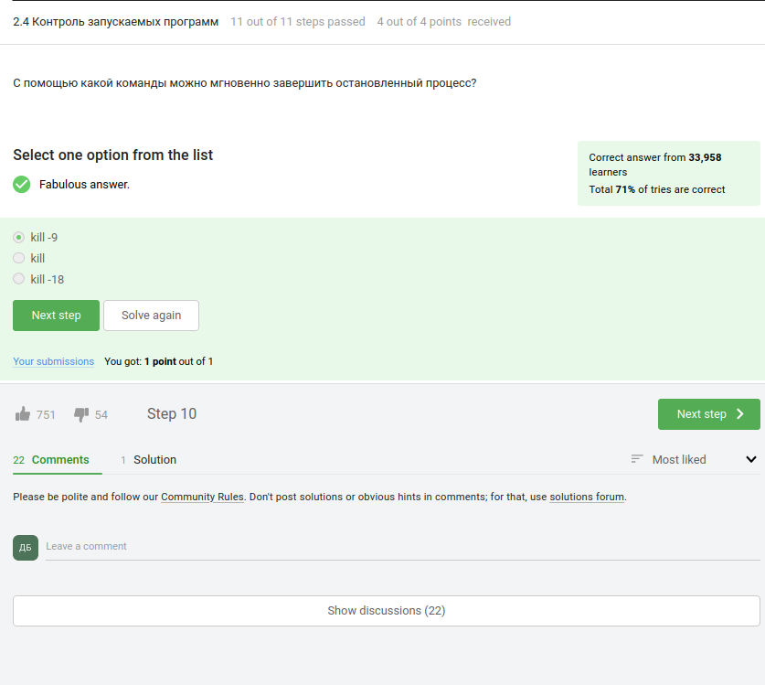{#fig:014 width=100%}

С помощью команды kill можно завершить остановленный процесс. Однако, для мгновенного принудительного завершения процесса, когда другие сигналы завершения не срабатывают, можно использовать опцию -9 в команде kill. Эта опция соответствует сигналу SIGKILL, который принудительно завершает процесс без возможности обработки или сохранения данных.

Таким образом, правильный ответ: kill -9.

Вопрос: Что произойдет, если использовать kill (без опций) по отношению к процессу, который был приостановлен при помощи Ctrl+Z?(рис. @fig:015).

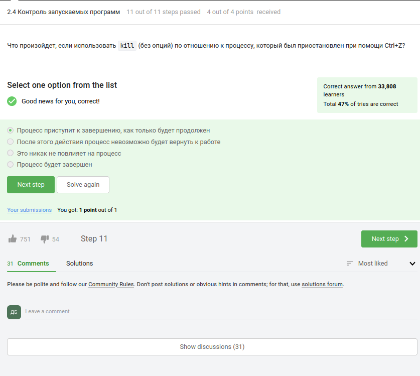{#fig:015 width=100%}

Если использовать команду `kill` (без опций) по отношению к процессу, который был приостановлен при помощи Ctrl+Z, процесс не будет завершен немедленно. Вместо этого, процесс будет отправлен сигналу SIGTERM, который является сигналом завершения по умолчанию. Это позволяет процессу выполнить необходимые действия для корректного завершения, например, сохранить данные или завершить выполняющиеся операции.

Таким образом, правильный ответ: Процесс приступит к завершению, как только будет продолжен.

Вопрос: Сколько вычислительных ресурсов центрального процессора (% CPU) использует остановленное (по Ctrl+Z) многопоточное приложение?
Учитывайте, что 100% CPU означает загрузку одного процессора, 200% CPU -- двух процессоров (на многопроцессорных и/или многоядерных компьютерах) и т.д. Например, выполняющееся в 4 потока приложение обычно использует около 400% CPU, однако наш вопрос касается именно момента после остановки такого приложения.(рис. @fig:016).

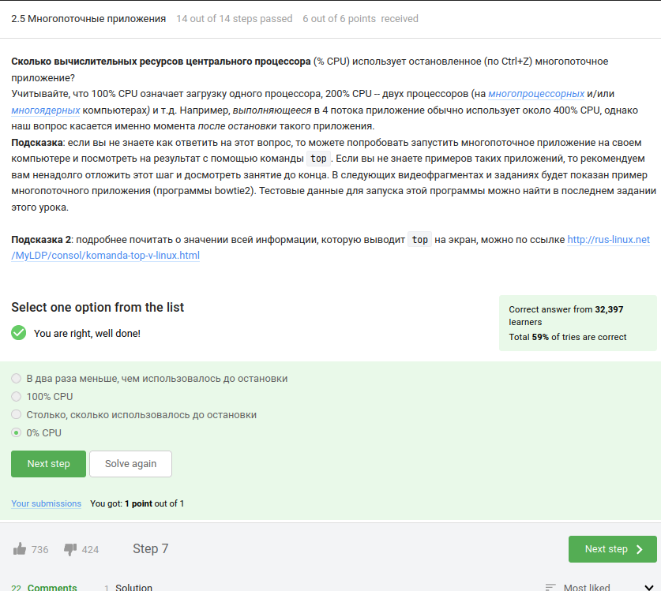{#fig:016 width=100%}

Когда многопоточное приложение останавливается с помощью Ctrl+Z, все его потоки приостанавливаются. В этом состоянии остановленного приложения, процессор не используется для выполнения кода приложения, и, следовательно, использование вычислительных ресурсов центрального процессора (% CPU) будет равно 0%.

Таким образом, правильный ответ: 0% CPU.

Вопрос: Сколько памяти занимает остановленное (по Ctrl+Z) многопоточное приложение?(рис. @fig:017).

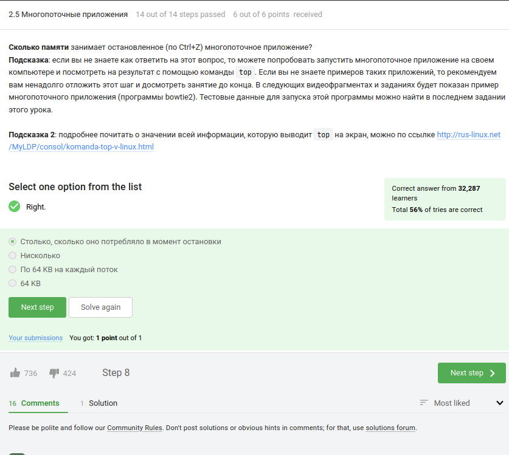{#fig:017 width=100%}

Остановленное многопоточное приложение не использует активно вычислительные ресурсы, но память, занятая им, остается выделенной. Остановка процесса с помощью Ctrl+Z не освобождает выделенную для него оперативную память.

Таким образом, ответ "Столько, сколько оно потребляло в момент остановки" является более точным. Память, занятая приложением до момента остановки, остается выделенной и будет занимать такой же объем до момента возобновления работы приложения или его полного завершения.

Вопрос: Как принудительно завершить один из потоков запущенного многопоточного приложения?(рис. @fig:018).

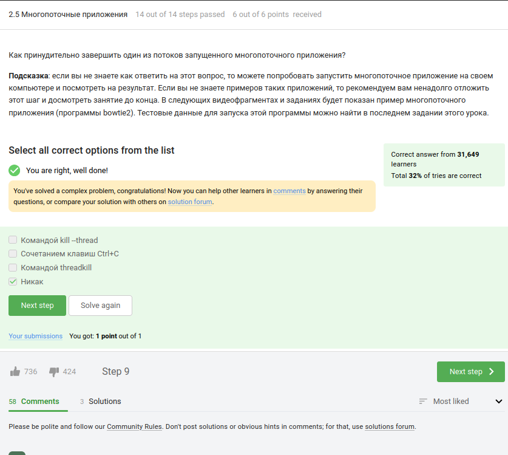{#fig:018 width=100%}

Никак. Принудительное завершение одного из потоков запущенного многопоточного приложения непосредственно извне является сложной задачей. Потоки внутри приложения обычно совместно используют ресурсы и завершение одного потока может нарушить работу других потоков и привести к непредсказуемым последствиям. Обычно завершение потоков должно быть корректно реализовано внутри самого приложения, с использованием соответствующих механизмов управления потоками и синхронизации.

Вопрос: Для выполнения этого задания вам потребуется программа bowtie2. 

Надеемся, что вы разобрались, что запуск bowtie2 состоит из двух шагов -- сначала запускаем подпрограмму bowtie2-build, а затем подпрограмму bowtie2. Изучите справочную информацию об этих подпрограммах (можно вызвать при помощи --help) и ответьте на вопрос -- какой(ие) из этих шагов можно выполнить в несколько потоков?(рис. @fig:019).

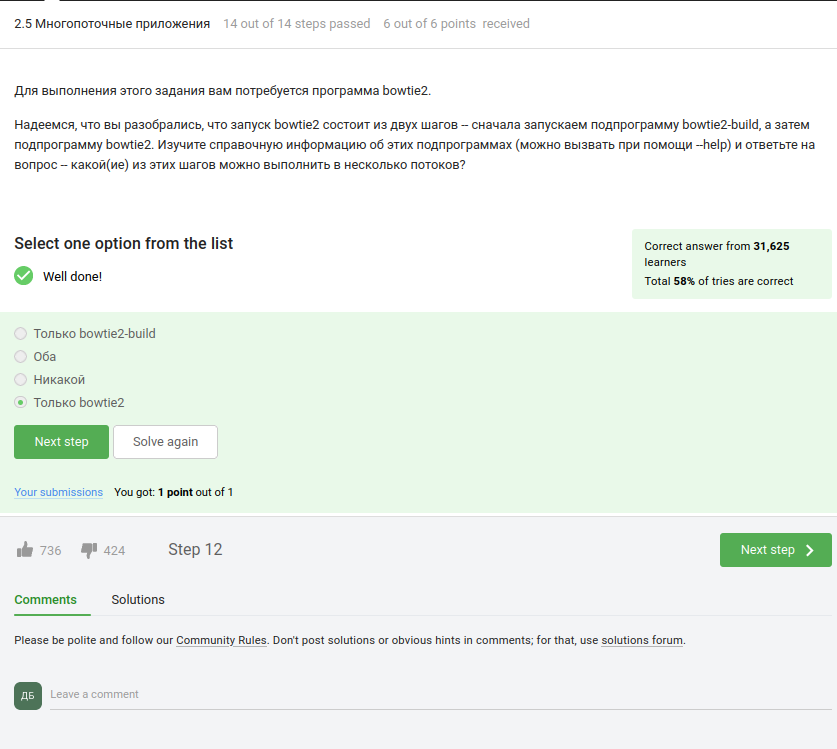{#fig:019 width=100%}

Из двух шагов запуска bowtie2 только подпрограмма bowtie2 может быть выполнена в несколько потоков. Подпрограмма bowtie2-build служит для построения индекса базы данных и выполняется в однопоточном режиме. Однако, при выполнении самого поиска с помощью bowtie2, можно указать параметр --threads для указания количества потоков, которые будут использованы при выравнивании последовательностей на индекс базы данных. Таким образом, только шаг выполнения bowtie2 может быть распараллелен.

Задание: Скачайте файлы, необходимые для запуска bowtie2: референсный геном (reference) и риды (reads). Запустите программу bowtie2 на этих данных (напоминаем, что запуск состоит из двух этапов!). Вывод stderr второго этапа (т.е. запуск подпрограммы bowtie2) запишите в файл (см. занятие про перенаправление ввода/вывода) и загрузите его в форму ниже. Мы также рекомендуем вам перенаправлять вывод stdout в файлы на обоих этапах, чтобы он не засорял экран вашего терминала.

Попробуйте теперь запустить второй этап (запуск подпрограммы bowtie2) в несколько потоков. Рекомендуем выставить число потоков равное количеству ядер на вашем компьютере (команда nproc). Сравните скорость выполнения в таком режиме с работой в один поток. Также рекомендуем убедиться, что результаты запусков (т.е. вывод в stderr) полностью совпали в обоих режимах!(рис. @fig:020).

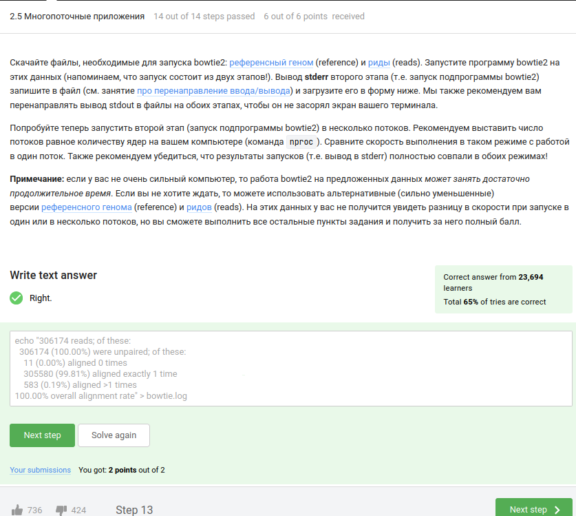{#fig:020 width=100%}

Скачиваем подходящую версию программы bowtie2

wget https://stepik.org/media/attachments/course73/programs/bowtie2-2.1.0-linux-x86_64.zip

Скачиваем файл референсного генома и файл с ридами

wget https://stepik.org/media/attachments/course73/reference.fasta

wget https://stepik.org/media/attachments/course73/reads.fastq.gz

Переходим в папку с загрузками

cd Downloads

Тихо (quiet), т.е. без вывода длинного списка файлов, распаковываем архив с программой 

unzip -q bowtie2-2.1.0-linux-x86_64.zip

Распаковываем риды, исходный архив на всякий случай не удаляем с помощью параметра -c

gunzip -c reads.fastq.qz > reads.fastq

Перемещаем распакованные риды в папку с программой

mv reads.fastq bowtie2-2.1.0/reads.fastq

Копируем туда же файл референсного генома

cp reference.fasta bowtie2-2.1.0/reference.fasta

Переходим в папку с программой

cd bowtie2-2.1.0

Создаём файл для вывода ошибок программы при работе в несколько потоков и файл для вывода всего остального

touch bowtie.log bowtie1.log

Запускаем построение индекса генома: передаём утилите bowtie2-build файл референсного генома и присваиваем ему индекс (любое слово), устанавливаем вывод с дозаписью в файл bowtie1.log для stdout и stderr

bowtie2-build reference.fasta index >> bowtie1.log 2>> bowtie1.log

Вспоминаем сколько ядер у нашего процессора
nproc

Передаём утилите bowtie2 индекс, присвоенный геному, с помощью параметра -x; передаём файл с ридами параметром -U; дописываем ключ -p для работы в многопоточном режиме; указываем вывод stderr в файл bowtie.log с дозаписью и добавляем & в конце строки для работы программы в фоновом режиме

bowtie2 -p 4 -x index -U reads.fastq >> bowtie1.log 2>> bowtie.log &

Вопрос: Вы открыли две вкладки в терминале. В одной из них вы запустили процесс и приостановили его. Переключившись во вторую вкладку и набрав fg, вы добьетесь следующего:(рис. @fig:021).

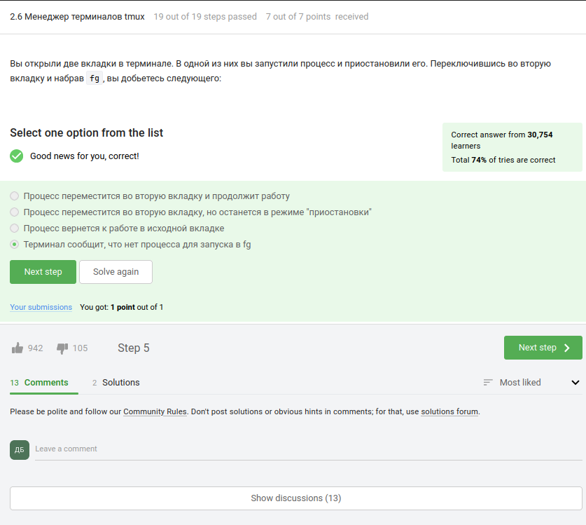{#fig:021 width=100%}

Терминал сообщит, что нет процесса для запуска в `fg`. Команда `fg` используется для возобновления остановленных процессов в текущей вкладке терминала. Если вы запустили процесс в одной вкладке и приостановили его, переключение в другую вкладку и выполнение команды `fg` не приведет к перемещению процесса во вторую вкладку. Процесс останется в оригинальной вкладке, и команда `fg` не будет иметь эффекта.

Вопрос: Предположим, что в tmux осталась последняя открытая вкладка. Что произойдет, если вы введете в этой вкладке в командную строку команду exit? (рис. @fig:022).

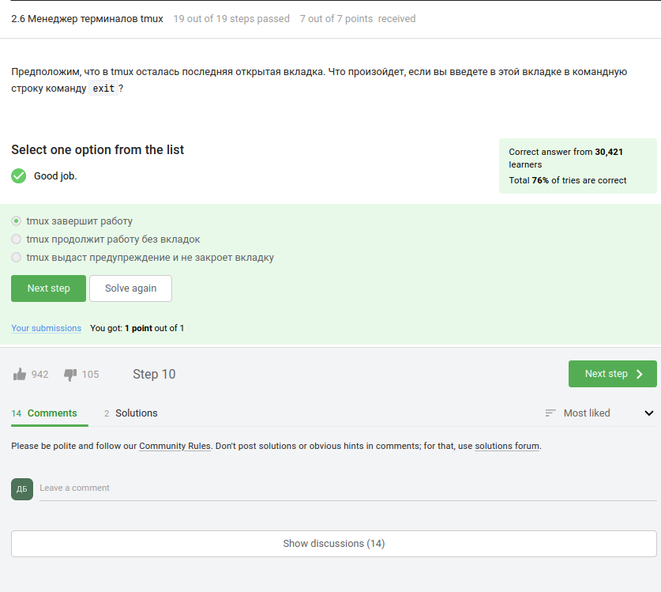{#fig:022 width=100%}

Если в tmux осталась последняя открытая вкладка и вы введете в командной строке команду `exit`, то tmux завершит свою работу и все вкладки будут закрыты. То есть, команда `exit` в последней вкладке tmux приведет к завершению самого tmux и закрытию всех вкладок.

Вопрос: Предположим, что вы открыли терминал, зашли в нем на сервер, запустили на этом сервере tmux и начали работу в нем. Что произойдет, если вы теперь закроете терминал?(рис. @fig:023).

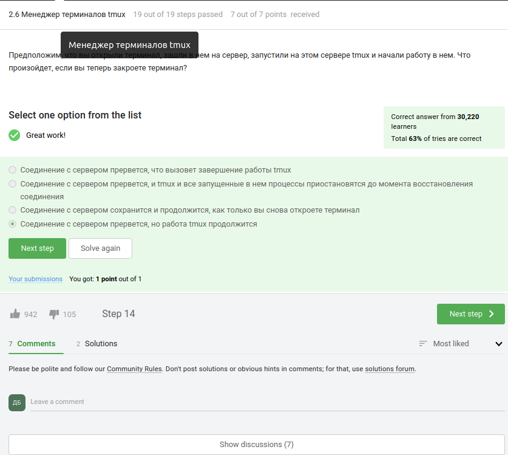{#fig:023 width=100%}

В случае, когда вы закрываете терминал, в котором работает tmux, соединение с сервером прервется. Однако, работа tmux и все запущенные в нем процессы продолжатся на сервере. Вы сможете восстановить соединение с сервером и продолжить работу в tmux, когда снова откроете терминал и подключитесь к серверу. Таким образом, правильный ответ: Соединение с сервером прервется, но работа tmux продолжится.

Вопрос: Что произойдет, если запустить процесс в фоновом режиме в одной из вкладок tmux, а затем принудительно закрыть эту вкладку (Ctrl+B, X)?(рис. @fig:024).

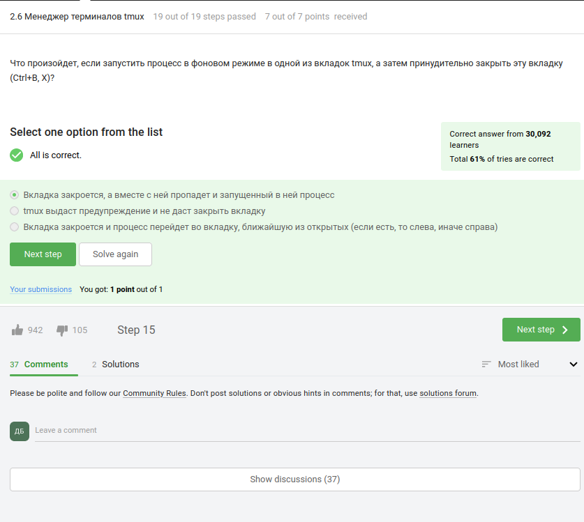{#fig:024 width=100%}

При принудительном закрытии вкладки в tmux (Ctrl+B, X) процесс, запущенный в этой вкладке, будет прерван. Вкладка закроется, и процесс не будет автоматически перенесен в другую вкладку.

Вопрос: Задание на самостоятельное изучение tmux. 

Изучите справку по tmux (например, man tmux) и выберите из предложенных ниже tmux-команд ту, которая отвечает за переименование текущей вкладки.(рис. @fig:025).

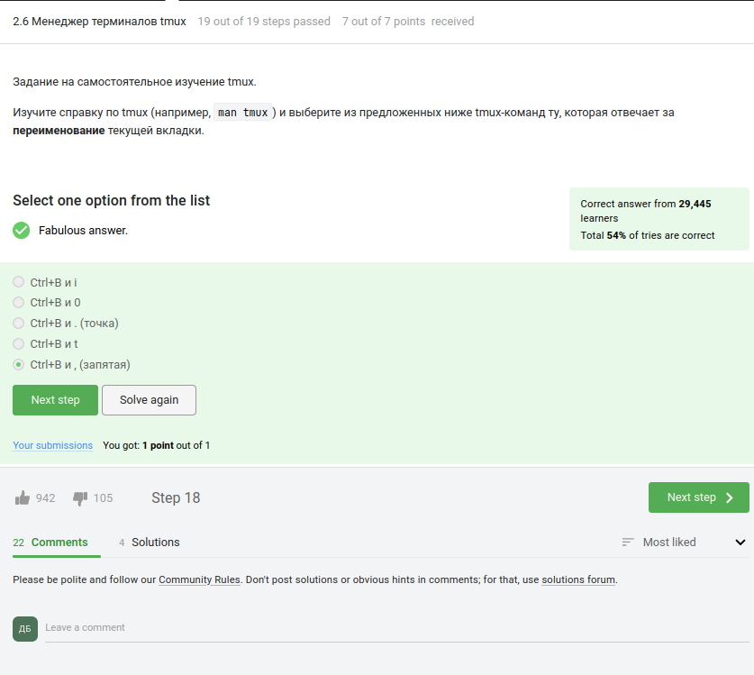{#fig:025 width=100%}

Изучив справку мы узнали, что команда, которая отвечает за переименование текущей вкладки в tmux, это "Ctrl+B" и "," (запятая).

Задание: Кроме создания нескольких вкладок, tmux умеет еще и разделять (split) одну вкладку на несколько, например, горизонтальной чертой на верхнюю и нижнюю или вертикальной чертой на левую и правую. Разделение может быть полезно, например, чтобы запустить процесс в верхней половине вкладки, а продолжить работу в нижней и одновременно следить за тем, что происходит с процессом. Для "горизонтального" разделения используется (Ctrl+B и "), а для "вертикального" -- (Ctrl+B и %).

Предлагаем вам самостоятельное изучить работу с "вкладками внутри вкладок" и отметить верные утверждения из списка ниже. Вы можете использовать справку по tmux (например, man tmux) или просто попробовать воспроизвести эти утверждениях у себя на компьютере.(рис. @fig:026).

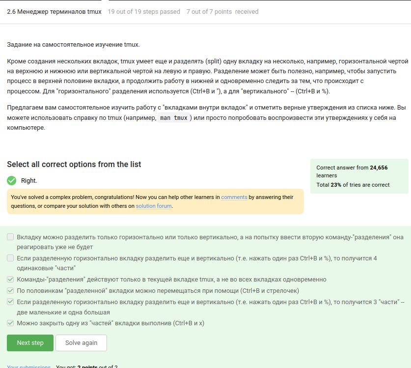{#fig:026 width=100%}

Давайте рассмотрим каждое утверждение по порядку:

1. Вкладку можно разделить только горизонтально или только вертикально, а на попытку ввести вторую команду-"разделения" она не будет реагировать. - Это утверждение неверно. Вкладку можно разделить как горизонтально, так и вертикально. Нажатие соответствующих комбинаций клавиш (Ctrl+B и " для горизонтального разделения и Ctrl+B и % для вертикального разделения) будет давать результат и допускается разделение в нескольких направлениях.

2. Если разделенную горизонтально вкладку разделить еще и вертикально, то получится 4 одинаковые "части". - Это утверждение неверно. Если горизонтально разделить вкладку и затем вертикально разделить одну из ее частей, то получится 3 "части": одна большая и две маленькие.

3. Команды-"разделения" действуют только в текущей вкладке tmux, а не во всех вкладках одновременно. - Это утверждение верно. Команды разделения применяются только к текущей активной вкладке в tmux.

4. По половинкам "разделенной" вкладки можно перемещаться при помощи (Ctrl+B и стрелочек). - Это утверждение верно. После разделения вкладки можно перемещаться между ее "частями" при помощи комбинации клавиш Ctrl+B и стрелок (вверх, вниз, влево, вправо).

5. Если разделенную горизонтально вкладку разделить еще и вертикально, то получится 3 "части" -- две маленькие и одна большая. - Это утверждение верно. Если горизонтально разделить вкладку и затем вертикально разделить одну из ее частей, то получится 3 "части": две маленькие и одна большая.

6. Можно закрыть одну из "частей" вкладки, выполнив (Ctrl+B и x). - Это утверждение верно. Для закрытия одной из "частей" вкладки в tmux можно использовать комбинацию клавиш Ctrl+B и x.

# Вывод

В ходе лабораторной работы мы познакомились с операционной системой Linux и основами её использования. В рамках курса установили Linux на компьютер, познакомились с программами в нем, поработали в терминале, зайшли на удаленный сервер и рассмотрели еще несколько продвинутых тем. Стоит отметить, что курс не является исчерпывающим и рассказывает только о базовых возможностях Linux, но, несмотря на это, рассказанного материала достаточно для успешного выполнения разноплановых задач в системе Linux.
