---
## Front matter
title: "Внешний курс Раздел 3. "
subtitle: "Продвинутые темы"
author: "Боровиков Даниил Александрович"

## Generic otions
lang: ru-RU
toc-title: "Содержание"

## Bibliography
bibliography: bib/cite.bib
csl: pandoc/csl/gost-r-7-0-5-2008-numeric.csl

## Pdf output format
toc: true # Table of contents
toc-depth: 2
lof: true # List of figures
fontsize: 12pt
linestretch: 1.5
papersize: a4
documentclass: scrreprt
## I18n polyglossia
polyglossia-lang:
  name: russian
  options:
	- spelling=modern
	- babelshorthands=true
polyglossia-otherlangs:
  name: english
## I18n babel
babel-lang: russian
babel-otherlangs: english
## Fonts
mainfont: PT Serif
romanfont: PT Serif
sansfont: PT Sans
monofont: PT Mono
mainfontoptions: Ligatures=TeX
romanfontoptions: Ligatures=TeX
sansfontoptions: Ligatures=TeX,Scale=MatchLowercase
monofontoptions: Scale=MatchLowercase,Scale=0.9
## Biblatex
biblatex: true
biblio-style: "gost-numeric"
biblatexoptions:
  - parentracker=true
  - backend=biber
  - hyperref=auto
  - language=auto
  - autolang=other*
  - citestyle=gost-numeric
## Pandoc-crossref LaTeX customization
figureTitle: "Рис."
listingTitle: "Листинг"
lofTitle: "Список иллюстраций"
lotTitle: "Список таблиц"
lolTitle: "Листинги"
## Misc options
indent: true
header-includes:
  - \usepackage{indentfirst}
  - \usepackage{float} # keep figures where there are in the text
  - \floatplacement{figure}{H} # keep figures where there are in the text
---
# Цель работы

Познакомиться с операционной системой Linux и основами её использования. В рамках курса установить Linux на компьютер, познакомиться с программами в нем, поработать в терминале, зайти на удаленный сервер и рассмотреть еще несколько продвинутых тем. Стоит отметить, что курс не является исчерпывающим и рассказывает только о базовых возможностях Linux, но, несмотря на это, рассказанного материала достаточно для успешного выполнения разноплановых задач в системе Linux.

# Выполнение внешнего курса

Вопрос: Какую клавишу(и) нужно нажать на клавиатуре, чтобы выйти из редактора vim? Считайте, что вы только что открыли файл и вам сразу понадобилось выйти из редактора.(рис. @fig:001).

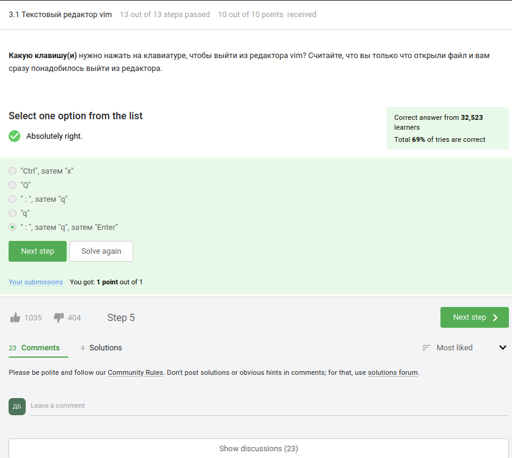{#fig:001 width=100%}

Верный ответ: " : ", затем "q", затем "Enter"

Для выхода из редактора Vim можно использовать комбинацию клавиш " : " (Shift+клавиша точка) для перехода в командный режим, затем ввести "q" для команды выхода (quit) и нажать клавишу "Enter" для подтверждения.

Вопрос: При перемещении в vim "по словам" есть небольшая разница в том, используем мы маленькую (w, e, b) или большую (W, E, B) букву. Первые перемещают нас по "словам" (word), а вторые по "большим словам" (WORD). Посмотрите справку по этим перемещениям и разберитесь в чем заключается разница между word и WORD.

А для того, чтобы убедиться, что вы разобрались, отметьте ниже все верные утверждения про следующую строку:
Strange_  TEXT  is_here. 2=2 YES!(рис. @fig:002).

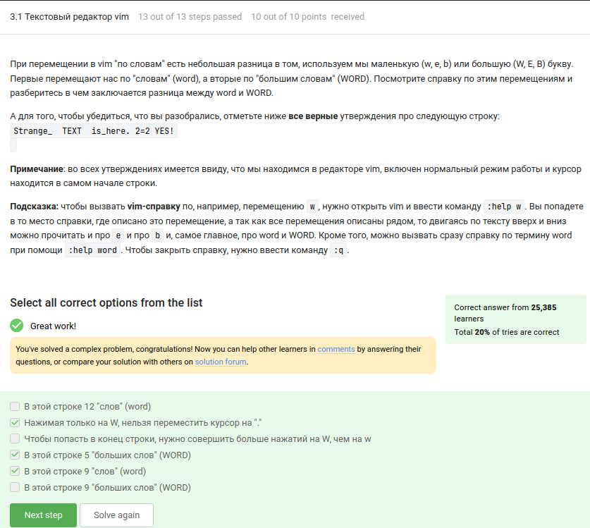{#fig:002 width=100%}

Для перемещения в Vim по словам и большим словам существует различие между маленькими и большими буквами. Вот некоторые различия между word и WORD:

Маленькие буквы (w, e, b) перемещают курсор между словами, где слово определяется последовательностью символов, разделенных пробелами или другими непечатаемыми символами.
Большие буквы (W, E, B) перемещают курсор между "большими словами", где большое слово определяется последовательностью непрерывных непечатаемых символов, таких как пробелы или знаки пунктуации.
Теперь давайте проверим утверждения относительно строки "Strange_ TEXT is_here. 2=2 YES!":

В этой строке 12 "слов" (word) - НЕВЕРНО. В данной строке 9 слов.
Нажимая только на W, нельзя переместить курсор на "." - ВЕРНО. Для перемещения курсора на ".", нужно использовать команду "e" (маленькая буква) или "E" (большая буква).
Чтобы попасть в конец строки, нужно совершить больше нажатий на W, чем на w - НЕВЕРНО. Для перемещения к концу строки можно использовать команды "e" или "E". Количество нажатий на "W" и "w" не влияет на достижение конца строки.
В этой строке 5 "больших слов" (WORD) - ВЕРНО. В данной строке 5 больших слов.
В этой строке 9 "слов" (word) - ВЕРНО. В данной строке 9 слов.
В этой строке 9 "больших слов" (WORD) - НЕВЕРНО. В данной строке 5 больших слов.

Вопрос: Предположим, что в текстовом файле записана одна единственная строка:
one two three four five
и вам нужно преобразовать её в строку
three four four four five

Какие(ой) из предложенных ниже наборов нажатий клавиш выполнят такое редактирование? В этих наборах нажатие на клавишу Esc обозначается как <Esc> (т.е. знаки "<" и ">" не несут отдельного смысла).(рис. @fig:003).

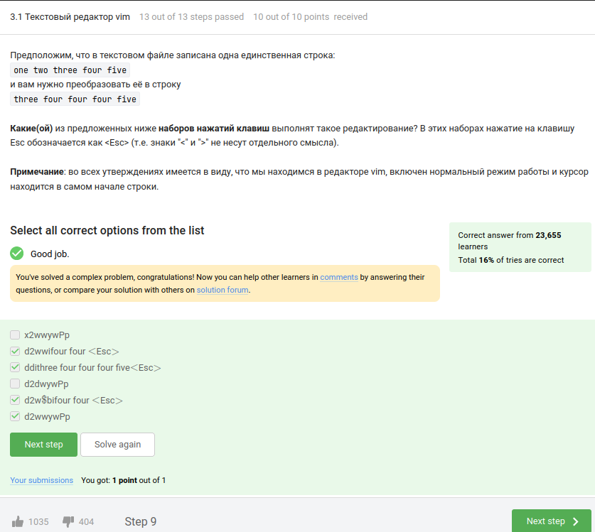{#fig:003 width=100%}

d2wwifour four <Esc> - Этот набор нажатий удалит первые два слова "one two", переместит курсор на слово "three" и войдет в режим вставки. Затем вставит текст "four four" и выйдет из режима вставки.

ddithree four four four five <Esc> - Этот набор нажатий удалит всю исходную строку, войдет в режим вставки, введет новую строку "three four four four five" и выйдет из режима вставки.

d2w$bifour four <Esc> - Этот набор нажатий удалит первые два слова "one two", переместит курсор на слово "three", переместит курсор в конец слова "three" и войдет в режим вставки. Затем вставит текст "four four" и выйдет из режима вставки.

d2wwywPp - Этот набор нажатий удалит первые два слова "one two", переместит курсор на слово "three", скопирует слово "three", переместит курсор на слово "four" и заменит его на "four four". Затем переместит курсор на слово "five" и вставит скопированное слово "three".

Зададние: Предположим, что вы открыли файл в редакторе vim и хотите заменить в этом файле все строки, содержащие слово Windows, на такие же строки, но со словом Linux. Если в какой-то строке слово Windows встречается больше, чем один раз, то заменить на Linux в этой строке нужно только самое первое из этих слов.

Какую команду нужно ввести для этого в vim? Укажите необходимую команду целиком (т.е. включая ввод ":" в самом начале), однако нажатие на Enter после ввода команды обозначать никак не нужно.(рис. @fig:004).

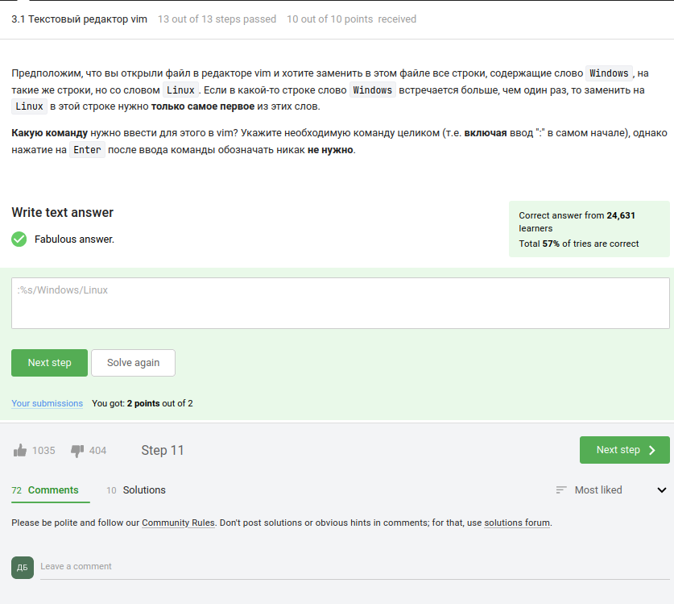{#fig:004 width=100%}

Необходимая команда:

:%s/Windows/Linux

Поиск и замена в Vim осуществляется командой :substitute, однако куда удобнее использовать для нее аббревиатуру :s. Общий синтаксис этой команды примерно такой:

:{пределы}s/{что заменяем}/{на что заменяем}/{опции}

Элемент {пределы} должен содержать область, в которой мы бы хотели, чтобы совершалась замена. Если опустить этот элемент, то поиск и замена будет произведен только в той строке, где располагается курсор. Для замены во всем файле можно использовать символ '%'. Для поиска и замены в области, начинающейся со строки l1 и заканчивающейся строкой l2, {пределы} должны иметь вид 'l1,l2', например :14,17s/ будет осуществлять поиск и замену в строках с 14-й по 17-ю. Отдельного упоминания заслуживают строка с курсором, номер которой символически обозначается точкой, и последняя строка, номер которой обозначается знаком доллара. Таким образом, для того, чтобы осуществить поиск от текущей строки до конца файла, используют команду ':.,$s/'.

Символ g, который завершает команду, обозначает поиск во всей строке. В противном случае Vim искал бы только первое совпадение в каждой из строк, входящих в {пределы}. Еще из полезных опций припоминаются опция 'n', которая осуществляет только поиск, но не заменяет (это помогает проверить, совпадают ли действительные критерии поиска с желаемыми), и 'с', которая спрашивает подтверждения перед каждым актом замены.

Вопрос: Мы совсем не рассказали вам про третий режим работы vim -- режим выделения (Visual). Предлагаем вам ознакомиться с ним самостоятельно. Например, это можно сделать во время прохождения упражнений в vimtutor, который мы настоятельно рекомендуем вам для изучения vim!

Чтобы убедиться, что вы разобрались с этим режимом работы, отметьте, пожалуйста, все верные утверждения из списка ниже.(рис. @fig:005).

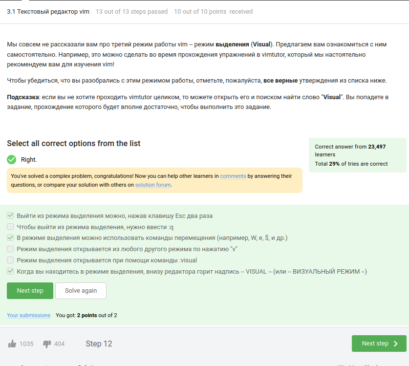{#fig:005 width=100%}

Из предложенных утверждений, верными являются следующие:

Выйти из режима выделения можно, нажав клавишу Esc два раза.
В режиме выделения можно использовать команды перемещения (например, W, e, $ и др.).
Когда вы находитесь в режиме выделения, внизу редактора горит надпись -- VISUAL -- (или -- ВИЗУАЛЬНЫЙ РЕЖИМ --).
Теперь рассмотрим каждое утверждение подробнее:

Выйти из режима выделения можно, нажав клавишу Esc два раза. После нажатия на Esc один раз, вы попадаете в командный режим, а при повторном нажатии Esc вы выходите из режима выделения и возвращаетесь в нормальный режим.

В режиме выделения (Visual mode) вы можете использовать команды перемещения, такие как W, e, $ и другие, чтобы перемещаться по тексту и выделять нужные фрагменты.

Когда вы находитесь в режиме выделения, внизу редактора отображается надпись "VISUAL" или "ВИЗУАЛЬНЫЙ РЕЖИМ", чтобы указать, что вы находитесь именно в этом режиме.

Утверждения о вводе ":q", открытии режима выделения с помощью "v" и отображении режима выделения через команду ":visual" не являются верными.

Задание: Для начала выполнения нажмите кнопку "Open Terminal". Скачайте в открывшемся терминале архив https://stepik.org/media/attachments/course73/byron.txt.gz в директорию /home/box и распакуйте его там (для этого вам пригодятся команды wget и gunzip).

Откройте в vim файл /home/box/byron.txt. Удалите все строки с 1001 по 2000 (включительно). Скопируйте строки с 5 по 11 (включительно) и вставьте их в самый конец файла, добавив одну пустую строку перед этой вставкой (т.е. строчка 5 должна следовать за ровно одной пустой строкой, а та за строкой с номером 6277). Замените в тексте все "Harold" на "Ivan".

Сохраните отредактированный файл с именем /home/box/byron_edited.txt (это можно сделать прямо из vim!).(рис. @fig:006).

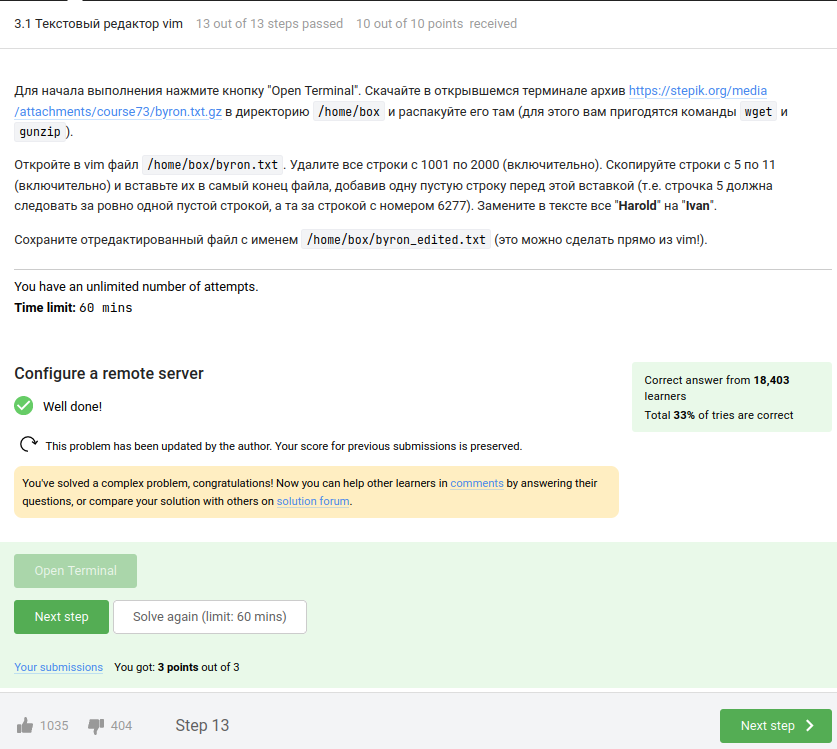{#fig:006 width=100%}

Порядок команд:

wget https://stepik.org/media/attachments/course73/byron.txt.gz && gunzip ./byron.txt.gz <Enter>

vim ./byron.txt <Enter>

:1001,2000d <Enter>

:5,11yank <Enter>

<G>, <O>, <Esc>, <p>

:%s/Harold/Ivan/g <Enter>

:w byron_edited.txt <Enter>

:q! <Enter>

Вопрос: Надеемся, что вы разобрались, что одну оболочку (например, sh) можно запустить из другой оболочки (например, из bash).

Предположим, что вы открыли терминал и у вас в нем запущена оболочка bash. Вы набираете в ней команды А1, А2, А3, а затем запускаете оболочку sh. В этой оболочке вы набираете команды B1, В2, В3 и запускаете оболочку bash. И, наконец, в этой последней оболочке вы набираете команды С1, С2, С3. Если теперь вы попробуете при помощи стрелочек вверх/вниз перемещаться по истории набранных команд, то команды из какого набора(ов) будут появляться?(рис. @fig:007).

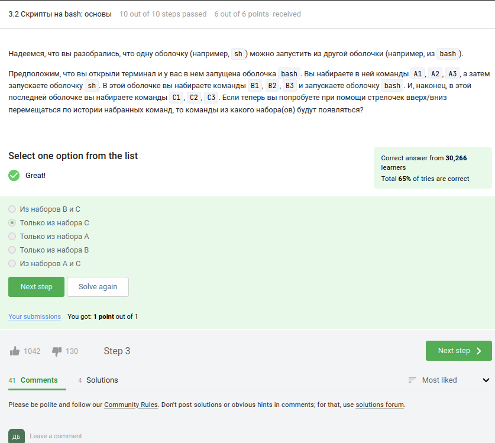{#fig:007 width=100%}

Если вы попробуете перемещаться по истории набранных команд при помощи стрелочек вверх/вниз в последней оболочке (bash), то будут появляться команды из набора С. Это происходит потому, что история команд сохраняется отдельно для каждой оболочки. При запуске оболочки sh вы создали новый процесс с отдельной историей команд, и то же самое произошло при запуске оболочки bash внутри sh. Поэтому при перемещении по истории в bash будут доступны только команды из последнего набора (набора С), который был введен в этой оболочке. Команды из наборов А и В не будут доступны в истории команд в bash.

Вопрос: Вы можете скачать и изучить скрипты, которые мы показали в видеофрагменте: script1.sh, script2.sh.

Предположим, что вы находитесь в директории /home/bi/Documents/ и запускаете в ней скрипт следующего содержания:

`#!/bin/bash`

cd /home/bi/
touch file1.txt
cd /home/bi/Desktop/
Как будет выглядеть абсолютный путь до созданного файла file1.txt по окончанию работы скрипта?(рис. @fig:008).

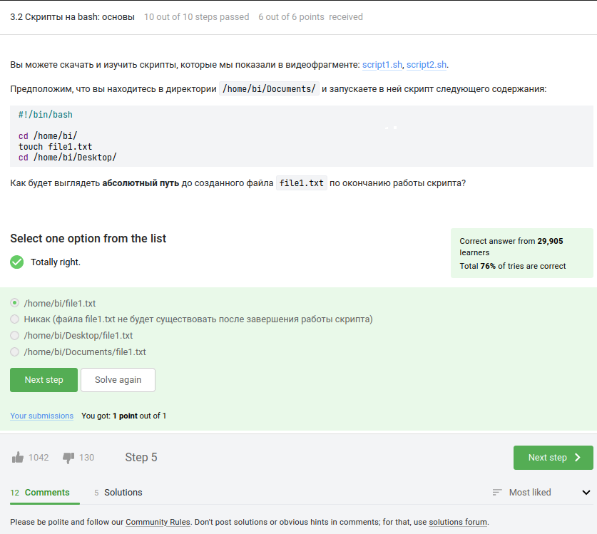{#fig:008 width=100%}

После окончания работы скрипта, абсолютный путь до созданного файла file1.txt будет: /home/bi/file1.txt.

В скрипте происходит следующее:

1. Строка `cd /home/bi/` изменяет текущую рабочую директорию на /home/bi/.
2. Строка `touch file1.txt` создает файл file1.txt в текущей рабочей директории, которая теперь является /home/bi/.
3. Строка `cd /home/bi/Desktop/` изменяет текущую рабочую директорию на /home/bi/Desktop/. Однако, после завершения работы скрипта, текущая рабочая директория в оболочке восстановится к исходной директории, в данном случае /home/bi/Documents.

Таким образом, созданный файл file1.txt будет находиться в директории, которая была активной на момент выполнения команды `touch`, т.е. в /home/bi/. Поэтому абсолютный путь до файла file1.txt будет /home/bi/file1.txt.

Вопрос: Вы можете скачать и изучить скрипты, которые мы показали в видеофрагменте: variables1.sh, variables2.sh.

Какие из представленных ниже строк могут быть именами переменных в bash? Выберите все подходящие варианты!(рис. @fig:009).

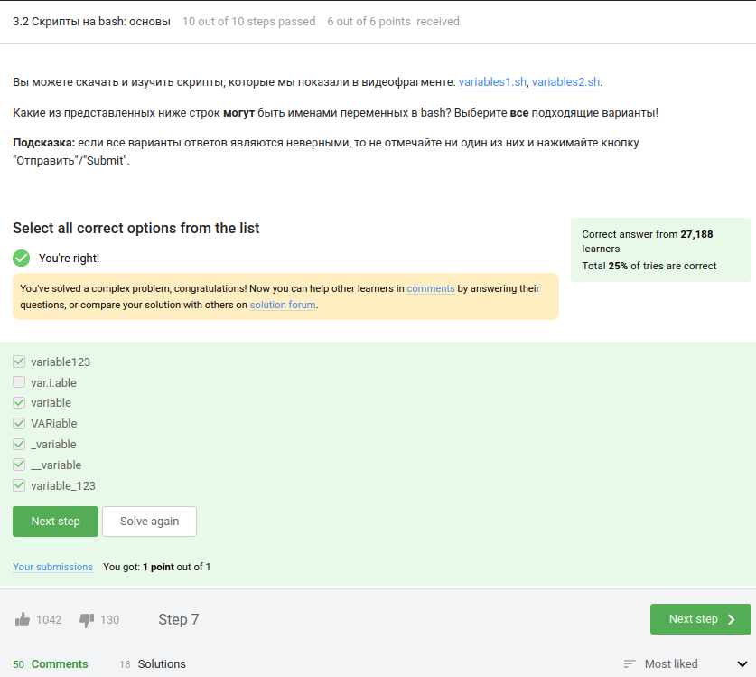{#fig:009 width=100%}

В языке bash следующие строки могут быть именами переменных:

- variable123

- variable

- VARiable

- ```_variable```

- ```__variable```

- variable_123

Имена переменных в bash могут состоять из букв (заглавных и строчных), цифр и символа подчеркивания. Однако, имя переменной не должно начинаться с цифры. Также, регистр имеет значение, поэтому переменные "variable" и "VARiable" будут различными.

Задание: Вы можете скачать и изучить скрипт, который мы показали в видеофрагменте: arguments.sh.

Напишите скрипт на bash, который принимает на вход два аргумента и выводит на экран строку следующего вида:

Arguments are: $1=первый_аргумент $2=второй_аргумент

Например, если ваш скрипт называется ./script.sh, то при запуске его ./script.sh one two на экране должно появиться:

Arguments are: $1=one $2=two

а при запуске ./script.sh three four будет:

Arguments are: $1=three $2=four(рис. @fig:010).

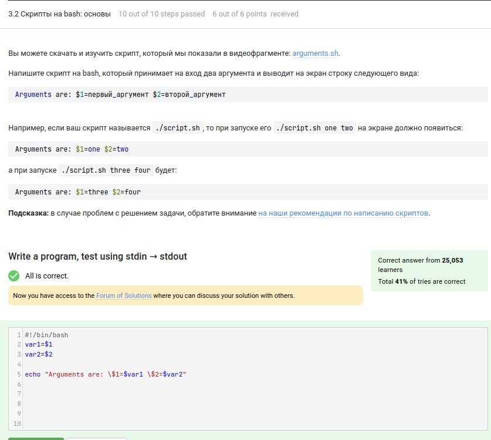{#fig:010 width=100%}

`#!/bin/bash`

var1=$1

var2=$2

echo "Arguments are: \$1=$var1 \$2=$var2"

Данный скрипт на языке bash принимает два аргумента командной строки и сохраняет их в переменные var1 и var2. Затем он выводит значения этих переменных с помощью команды echo.

Вопрос: Предположим, вы пишете скрипт на bash и хотите использовать в нем конструкцию if в следующем фрагменте:

if [[ ... ]]

then

  echo "True"

fi

Вы можете вписать вместо "..." (внутри [[ ]] и не забудьте про пробелы после [[ и перед ]]!) любое из перечисленных ниже условий. Однако мы просим вас выбрать только те из них, при которых echo напечатает на экран True вне зависимости от того, с какими параметрами был запущен ваш скрипт и какие в нем есть переменные.

Например, условие 0 -eq 0 подходит, т.к. ноль всегда равен нулю вне зависимости от аргументов и переменных внутри скрипта и на экран будет напечатано True.  В то же время условие $var1 -eq 0 не подходит, так как в переменной var1 как может быть записан ноль (тогда будет напечатано True), так его может и не быть (тогда ничего напечатано не будет).(рис. @fig:011).

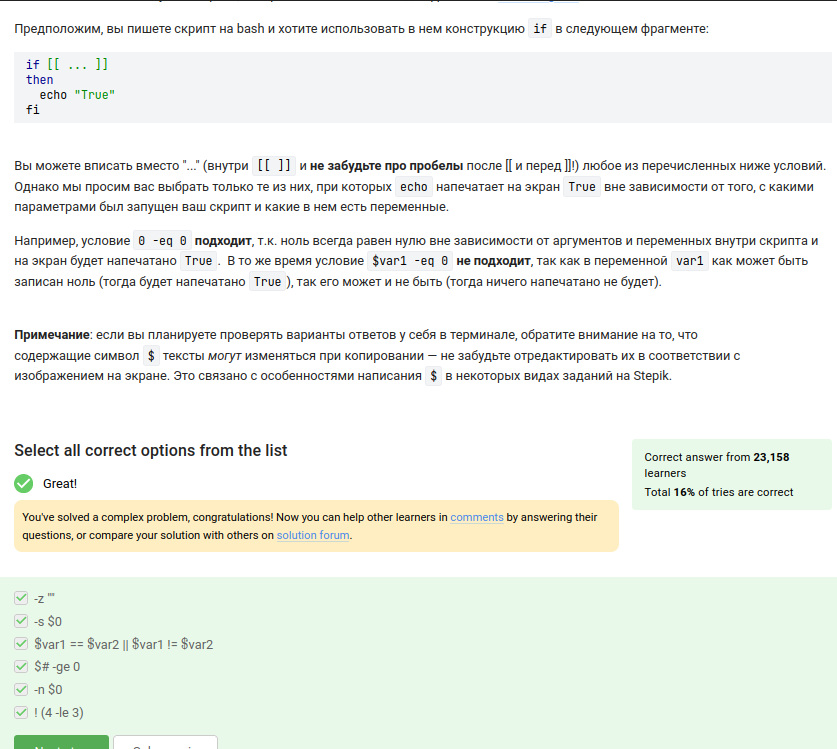{#fig:011 width=100%}

Да, все предложенные ответы верны. Вот почему:

- `-z ""`: Это проверка на пустую строку, и так как пустая строка будет равна пустой строке независимо от аргументов и переменных в скрипте, условие будет выполняться и на экран будет выведено "True".

- `-s $0`: Это проверка на непустую строку, а `$0` представляет собой имя самого скрипта. Так как имя скрипта всегда будет непустой строкой, условие будет выполнено и на экран будет выведено "True".

- `$var1 == $var2 || $var1 != $var2`: Это проверка на равенство и неравенство двух переменных `var1` и `var2`. Независимо от значений этих переменных, одно из условий всегда будет выполняться, и на экран будет выведено "True".

- `$# -ge 0`: `$#` представляет количество аргументов командной строки. Так как количество аргументов всегда будет больше или равно нулю (минимум будет 0), условие будет выполняться и на экран будет выведено "True".

- `-n $0`: Это проверка на непустую строку, а `$0` представляет собой имя самого скрипта. Так как имя скрипта всегда будет непустой строкой, условие будет выполнено и на экран будет выведено "True".

- `!(4 -le 3)`: Это отрицание условия "4 меньше или равно 3". Поскольку это условие неверно, отрицание будет истинным и на экран будет выведено "True".

Таким образом, все предложенные варианты будут выводить "True" на экран независимо от аргументов и переменных в скрипте.

Вопрос: Посмотрите на фрагмент bash-скрипта:

if [[ $var -gt 5 ]]

then

  echo "one" 

elif [[ $var -lt 3 ]]

then

  echo "two"

elif [[ $var -eq 4 ]]

then

  echo "three"

else

  echo "four"

fi

Какие строки и в какой последовательности он выведет на экран, если сначала этот скрипт запустили задав переменную var=3, а затем запустили еще раз, но уже с var=5.(рис. @fig:012).

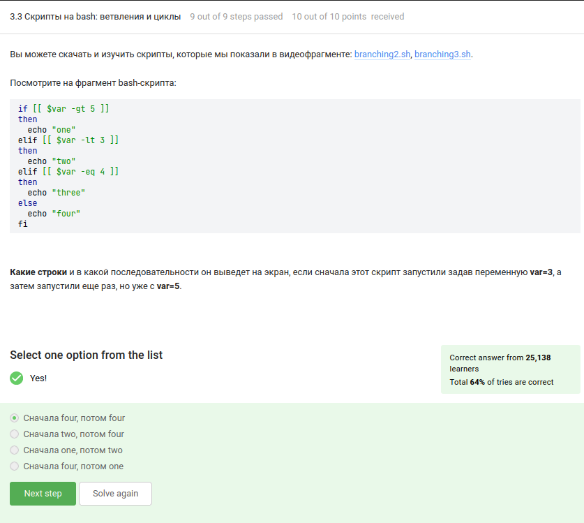{#fig:012 width=100%}

Если сначала этот скрипт запустили с переменной `var=3`, а затем с `var=5`, то строки будут выведены в следующей последовательности:

- Сначала "four": Переменная `var` не удовлетворяет условию `-gt 5`, не удовлетворяет условию `-lt 3` и не равна 4, поэтому выполняется блок `else`, и на экран будет выведено "four".
- Затем еще раз "four": В этом случае `var` также не удовлетворяет условию `-gt 5`, не удовлетворяет условию `-lt 3` и не равна 4, поэтому снова выполняется блок `else`, и на экран будет выведено "four".

Таким образом, верный ответ: Сначала "four", потом "four".

Задание: Напишите скрипт на bash, который принимает на вход один аргумент (целое число от 0 до бесконечности), который будет обозначать число студентов в аудитории. В зависимости от значения числа нужно вывести разные сообщения. 

Соответствие входа и выхода должно быть таким:

0 -->  No students

1 -->  1 student

2 -->  2 students

3 -->  3 students

4 -->  4 students

5 и больше --> A lot of students

Примечание а): выводить нужно только строку справа, т.е. "-->" выводить не нужно.

Примечание б): в последней строке слово "lot" с маленькой буквы!

Примечание 2: в этой и всех последующих задачах на написание скриптов, если не указано явно, что нужно проверять вход (например, что он будет именно числом и именно от 0 до бесконечности), то этого делать не нужно!

Пример №1: если ваш скрипт называется ./script.sh, то при запуске его как ./script.sh 1 на экране должно появиться:
1 student

Пример №2: если ваш скрипт называется ./script.sh, то при запуске его как ./script.sh 5 на экране должно появиться:
A lot of students(рис. @fig:013).

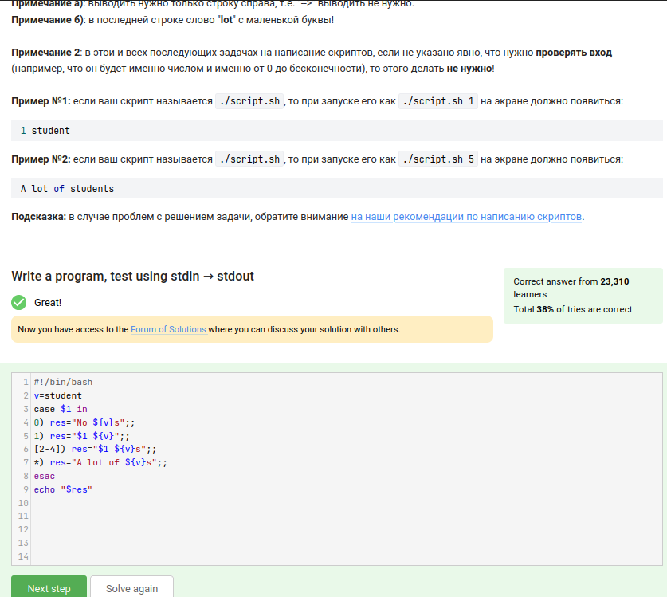{#fig:013 width=100%}

```
#!/bin/bash
```

Эта строка указывает на то, что скрипт должен быть интерпретирован с использованием оболочки bash.

```
v=student
```

В этой строке создается переменная `v` и ей присваивается значение "student".

```
case $1 in
```

Это начало конструкции `case`, которая проверяет значение переменной `$1` (первый аргумент, переданный скрипту) и сравнивает его с различными шаблонами.

```
0) res="No ${v}s";;
```

Если значение `$1` равно 0, то эта строка присваивает переменной `res` значение "No students".

```
1) res="$1 ${v}";;
```

Если значение `$1` равно 1, то эта строка присваивает переменной `res` значение "1 student".

```
[2-4]) res="$1 ${v}s";;
```

Если значение `$1` является числом от 2 до 4 включительно, то эта строка присваивает переменной `res` значение "$1 students".

```
*) res="A lot of ${v}s";;
```

Если значение `$1` не соответствует ни одному из указанных выше шаблонов, то эта строка присваивает переменной `res` значение "A lot of students".

```
esac
```

Это завершение конструкции `case`, которая указывает на то, что все условия проверены и выполнение кода должно продолжиться после этой конструкции.

```
echo "$res"
```

Эта строка выводит значение переменной `res` на экран. В результате будет напечатано одно из сообщений, зависящее от значения `$1` и соответствующего шаблона в конструкции `case`.

Вопрос: Посмотрите на фрагмент bash-скрипта:

for str in a , b , c_d
do
  echo "start"
  if [[ $str > "c" ]]
  then
    continue
  fi
  echo "finish"
done

Если запустить этот скрипт, то сколько раз на экран будет выведено слово "start", а сколько раз слово "finish"?(рис. @fig:014).

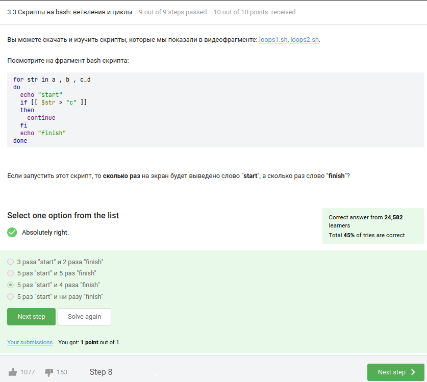{#fig:014 width=100%}

Правильный ответ - 5 раз "start" и 4 раза "finish".

В данном скрипте используется цикл `for`, который пробегает по элементам `a`, `,`, `b`, `,`, `c_d`. Таким образом, цикл выполнится 5 раз:

1. На первой итерации значение переменной `str` будет равно "a". Выведется "start", условие `[[ $str > "c" ]]` не будет выполнено, поэтому выведется "finish".

2. На второй итерации значение переменной `str` будет равно ",". Выведется "start", условие `[[ $str > "c" ]]` не будет выполнено, поэтому выведется "finish".

3. На третьей итерации значение переменной `str` будет равно "b". Выведется "start", условие `[[ $str > "c" ]]` не будет выполнено, поэтому выведется "finish".

4. На четвертой итерации значение переменной `str` будет равно ",". Выведется "start", условие `[[ $str > "c" ]]` не будет выполнено, поэтому выведется "finish".

5. На пятой итерации значение переменной `str` будет равно "c_d". Выведется "start", условие `[[ $str > "c" ]]` будет выполнено (строка "c_d" больше чем "c"), поэтому выполнение цикла продолжится с начала и выведется "start". Затем условие будет не выполнено, и выведется "finish".

Таким образом, слово "start" будет выведено 5 раз, а слово "finish" - 4 раза.

Задание: Напишите скрипт на bash, который будет определять в какую возрастную группу попадают пользователи. При запуске скрипт должен вывести сообщение "enter your name:" и ждать от пользователя ввода имени (используйте read, чтобы прочитать его). Когда имя введено, то скрипт должен написать "enter your age:" и ждать ввода возраста (опять нужен read). Когда возраст введен, скрипт пишет на экран "<Имя>, your group is <группа>", где <группа> определяется на основе возраста по следующим правилам:

младше либо равно 16: "child",

от 17 до 25 (включительно): "youth",

старше 25: "adult".

После этого скрипт опять выводит сообщение "enter your name:" и всё начинается по новой (бесконечный цикл!). Если в какой-то момент работы скрипта будет введено пустое имя или возраст 0, то скрипт должен написать на экран "bye" и закончить свою работу (выход из цикла!).(рис. @fig:015).

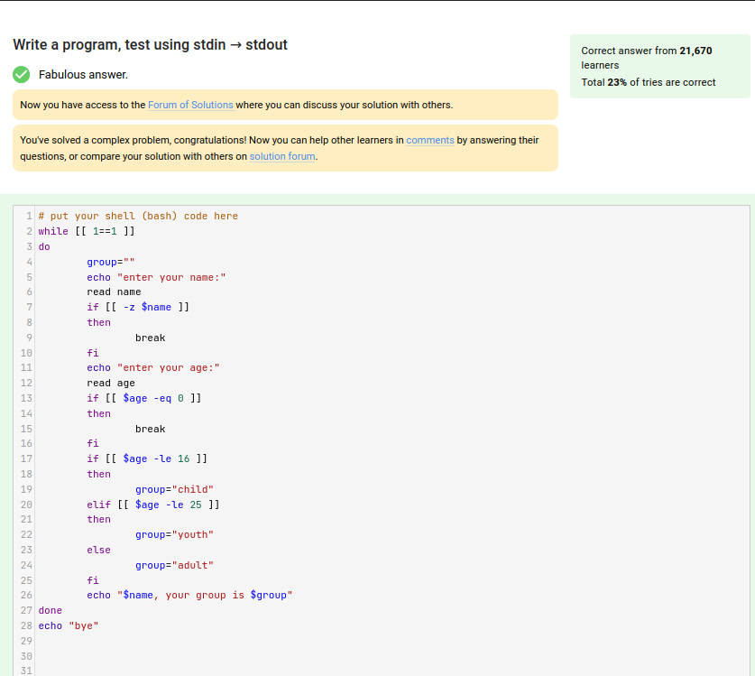{#fig:015 width=100%}

while [[ 1==1 ]]

do

        group=""

        echo "enter your name:"

        read name

        if [[ -z $name ]]

        then

                break

        fi

        echo "enter your age:"

        read age

        if [[ $age -eq 0 ]]

        then

                break

        fi

        if [[ $age -le 16 ]]

        then

                group="child"

        elif [[ $age -le 25 ]]

        then

                group="youth"

        else

                group="adult"

        fi

        echo "$name, your group is $group"

done

echo "bye"

Приведенный фрагмент кода на языке Shell (bash) представляет собой бесконечный цикл, который запрашивает у пользователя имя и возраст и на основе введенных данных определяет группу (child, youth или adult). Цикл продолжается до тех пор, пока пользователь не введет пустое имя или возраст равный 0. После выхода из цикла выводится сообщение "bye".

Краткое описание работы скрипта:

Устанавливается бесконечный цикл с условием [[ 1==1 ]], что всегда истинно.
Внутри цикла переменной group присваивается пустое значение.
Выводится приглашение "enter your name:" и считывается значение введенное пользователем в переменную name.
Если значение переменной name пустое (пользователь не ввел имя), то происходит выход из цикла при помощи команды break.
Выводится приглашение "enter your age:" и считывается значение введенное пользователем в переменную age.
Если значение переменной age равно 0, то также происходит выход из цикла при помощи команды break.
Если значение переменной age меньше или равно 16, то переменной group присваивается значение "child".
Если значение переменной age больше 16 и меньше или равно 25, то переменной group присваивается значение "youth".
Если значение переменной age больше 25, то переменной group присваивается значение "adult".
Выводится сообщение с именем пользователя и его группой: "$name, your group is $group".
Цикл повторяется снова с запросом имени.
После выхода из цикла выводится сообщение "bye".

Таким образом, скрипт позволяет пользователю вводить имя и возраст и выводит соответствующую группу, пока пользователь не введет пустое имя или возраст равный 0.


Вопрос: Какие(ая) из предложенных ниже инструкций увеличат значение переменной а на значение переменной b? Например, если в а было записано 10, в b было 5, то в а должно записаться 15. 
Выберите все подходящие варианты!(рис. @fig:016).

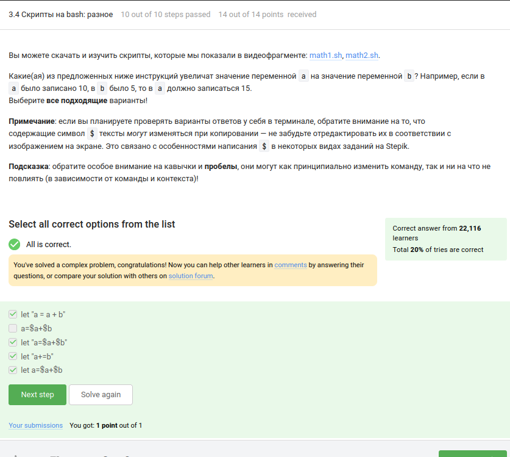{#fig:016 width=100%}

Правильные ответы:

1. `let "a = a + b"`

2. `let "a=$a+$b"`

3. `let "a+=b"`

4. `let a=$a+$b`

Эти инструкции увеличат значение переменной `a` на значение переменной `b`. Они используют операторы сложения и присваивания для выполнения этой операции.

Вопрос: Пусть вы находитесь в директории /home/bi/Documents/ и запускаете в ней скрипт следующего содержания:

`#!/bin/bash`

cd /home/bi/

echo "`pwd`"

Что в этом случае выведет команда echo на экран?(рис. @fig:017).

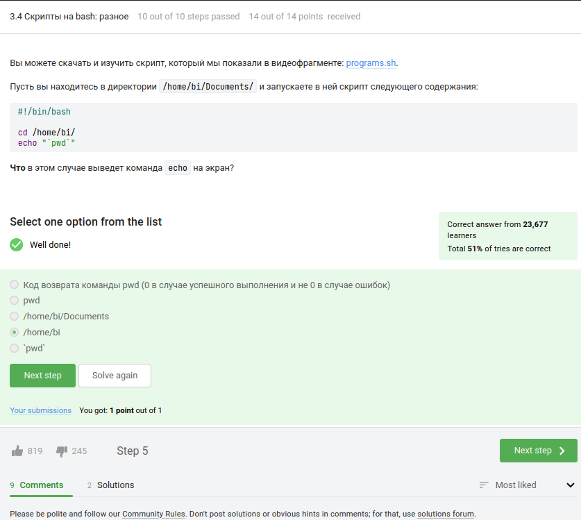{#fig:017 width=100%}

В этом случае команда `echo` выведет следующую строку на экран:

`/home/bi/`

Она отображает текущий рабочий каталог после выполнения команды `cd /home/bi/`, которая перемещает вас в каталог `/home/bi/`.

Вопрос: Мы рассказали, что можно проверить код возврата внешней программы прямо в конструкции if при помощи if `program options arguments` (действия внутри if выполнятся, если программа закончилась с кодом 0). Однако это не всегда правда! Если запуск внешней программы выводит что-то в stdout, то в проверку if поступит именно этот вывод, а не код возврата! Вы можете убедиться в этом, написав простой bash-скрипт с использованием, например, if `pwd`.


Однако как быть, если хочется всё-таки запустить программу program, которая пишет что-то в stdout и потом выполнить какие-то действия если ее код возврата равен 0? Выберите все верные утверждения или правильно работающие конструкции if.(рис. @fig:018).

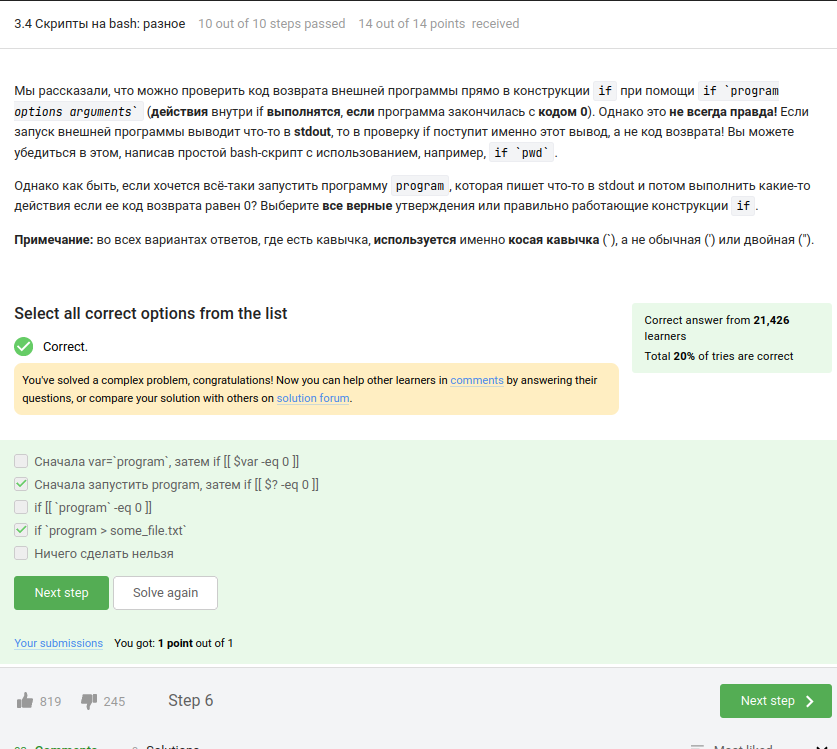{#fig:018 width=100%}

Верные ответы:

- Сначала запустить `program`, затем `if [[ $? -eq 0 ]]`. В данном случае `$?` представляет код возврата последней выполненной команды, то есть `program`. Это позволяет проверить успешное выполнение программы.

- ``if program > some_file.txt``. В этом варианте вывод программы `program` будет перенаправлен в файл `some_file.txt`, а проверка кода возврата произойдет в конструкции `if`. Если код возврата равен 0, то выполнится соответствующий блок.

Пояснение:

- Вариант `Сначала var=`program`, затем if [[ $var -eq 0 ]]` не сработает, так как при присваивании `var=`program, в `var` будет записан вывод программы `program`, а не ее код возврата. Проверка `if [[ $var -eq 0 ]]` будет сравнивать вывод программы с числом 0, а не код возврата.

- Вариант `if [[ `program` -eq 0 ]]` также не сработает, так как результат выполнения `program` будет интерпретирован как строка, а не число. Сравнение с числом 0 не будет работать корректно.

- Утверждение "Ничего сделать нельзя" неверно, так как есть возможности для выполнения действий при условии успешного выполнения программы с кодом возврата 0.

Вопрос: Вы можете скачать и изучить скрипты, которые мы показали в видеофрагменте: functions1.sh, functions2.sh.

Посмотрите на функцию из bash-скрипта:

counter ()  # takes one argument

{

  `local let "c1+=$1"`

  `let "c2+=${1}*2"`

} 
 

Впишите в форму ниже строку, которую выведет на экран команда echo "counters are $c1 and $c2" если она находится в скрипте после десяти вызовов функции counter с параметрами сначала 1, затем 2, затем 3 и т.д., последний вызов с параметром 10.(рис. @fig:019).

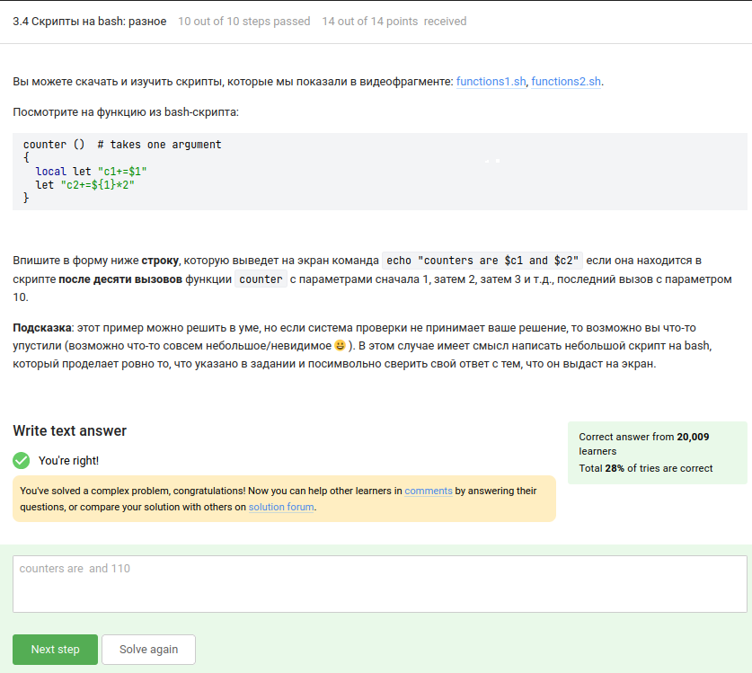{#fig:019 width=100%}

Правильный ответ: `counters are  and 110`.

Объяснение:
В данной функции `counter`, переменные `c1` и `c2` объявлены как локальные с помощью ключевого слова `local`. По умолчанию, если переменные не инициализированы, они имеют пустое значение или значение 0. В данном случае, `c1` не инициализируется перед первым вызовом функции, поэтому она имеет пустое значение. Внутри функции, значение `c1` увеличивается на переданный аргумент, а значение `c2` вычисляется как удвоенное значение переданного аргумента.

После выполнения десяти вызовов функции `counter`, значение `c1` остается пустым, так как внутри функции `local` создает локальную копию переменной, не влияющую на глобальное значение. Значение `c2` накапливается суммированием удвоенных значений переданных аргументов от 1 до 10, что дает сумму 110.

Поэтому, команда `echo "counters are $c1 and $c2"` выведет `counters are  and 110`.

Задание: Напишите скрипт на bash, который будет искать наибольший общий делитель (НОД, greatest common divisor, GCD) двух чисел. При запуске ваш скрипт не должен ничего писать на экран, а просто ждет ввода двух натуральных чисел через пробел (для этого можно использовать read и указать ему две переменные -- см. пример в видеофрагменте). После ввода чисел скрипт считает их НОД и выводит на экран сообщение "GCD is <посчитанное значение>", например, для чисел 15 и 25 это будет "GCD is 5". После этого скрипт опять входит в режим ожидания двух натуральных чисел. Если в какой-то момент работы пользователь ввел вместо этого пустую строку, то нужно написать на экран "bye" и закончить свою работу. 

Вычисление НОД несложно реализовать с помощью алгоритма Евклида. Вам нужно написать функцию gcd, которая принимает на вход два аргумента (назовем их M и N). Если аргументы равны, то мы нашли НОД -- он равен M (или N), нужно выводить соответствующее сообщение на экран (см. выше). Иначе нужно сравнить аргументы между собой. Если M больше N, то запускаем ту же функцию gcd, но в качестве первого аргумента передаем (M-N), а в качестве второго N. Если же наоборот, M меньше N, то запускаем функцию gcd с первым аргументом M, а вторым (N-M).

Пример корректной работы скрипта:

./script.sh

10 15

GCD is 5

7 3 

GCD is 1

bye(рис. @fig:020).

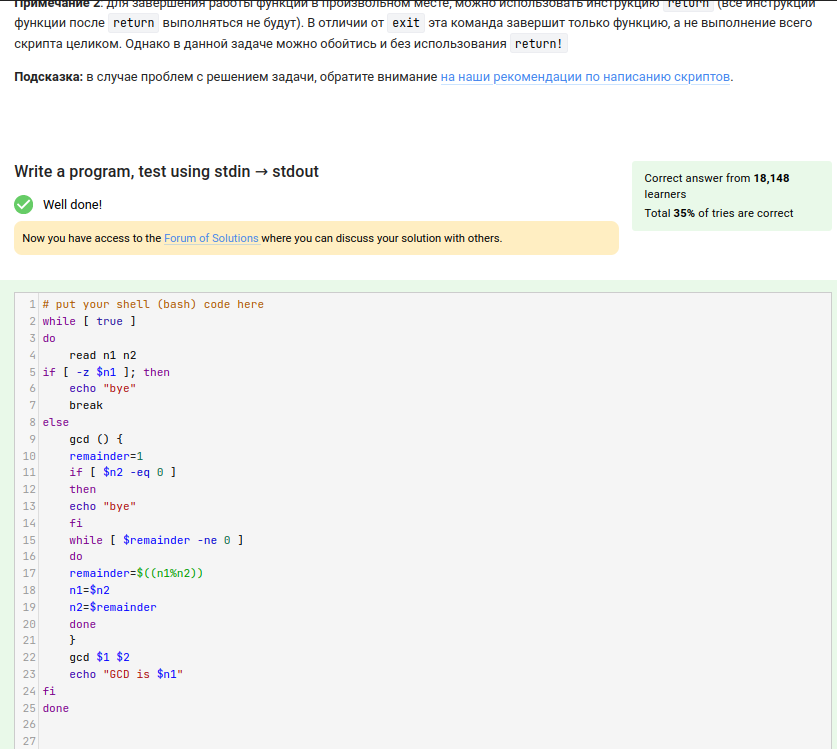{#fig:020 width=100%}

Скрипт:

while [ true ] 

do

    read n1 n2

if [ -z $n1 ]; then

    echo "bye"

    break

else

    gcd () {

    remainder=1

    if [ $n2 -eq 0 ]

    then

    echo "bye"

    fi

    while [ $remainder -ne 0 ]

    do

    remainder=$((n1%n2))

    n1=$n2

    n2=$remainder

    done

    }

    gcd $1 $2

    echo "GCD is $n1" 

fi

done

Данный скрипт является бесконечным циклом, который считывает два числа `n1` и `n2` с помощью команды `read`. Затем происходит проверка наличия значения `n1` с помощью условного оператора `if [ -z $n1 ]`. Если `n1` является пустой строкой, выводится сообщение "bye" и цикл прерывается с помощью команды `break`.

В противном случае, определяется функция `gcd`, которая находит наибольший общий делитель (НОД) двух чисел `n1` и `n2`. Для вычисления НОД используется алгоритм Евклида. Внутри функции выполняется цикл, пока остаток от деления `n1` на `n2` не станет равным 0. На каждой итерации значения `n1` и `n2` обновляются, чтобы продолжить вычисления. После выхода из цикла, значение `n1` содержит НОД.

Затем выводится сообщение "GCD is $n1", где `$n1` представляет найденное значение НОД.

Таким образом, скрипт продолжает запрашивать ввод чисел и находить их НОД до тех пор, пока пользователь не введет пустую строку вместо `n1`, после чего скрипт завершается.

Задание: Напишите скрипт на bash, который будет искать наибольший общий делитель (НОД, greatest common divisor, GCD) двух чисел. При запуске ваш скрипт не должен ничего писать на экран, а просто ждет ввода двух натуральных чисел через пробел (для этого можно использовать read и указать ему две переменные -- см. пример в видеофрагменте). После ввода чисел скрипт считает их НОД и выводит на экран сообщение "GCD is <посчитанное значение>", например, для чисел 15 и 25 это будет "GCD is 5". После этого скрипт опять входит в режим ожидания двух натуральных чисел. Если в какой-то момент работы пользователь ввел вместо этого пустую строку, то нужно написать на экран "bye" и закончить свою работу. 

Вычисление НОД несложно реализовать с помощью алгоритма Евклида. Вам нужно написать функцию gcd, которая принимает на вход два аргумента (назовем их M и N). Если аргументы равны, то мы нашли НОД -- он равен M (или N), нужно выводить соответствующее сообщение на экран (см. выше). Иначе нужно сравнить аргументы между собой. Если M больше N, то запускаем ту же функцию gcd, но в качестве первого аргумента передаем (M-N), а в качестве второго N. Если же наоборот, M меньше N, то запускаем функцию gcd с первым аргументом M, а вторым (N-M).

Пример корректной работы скрипта:

./script.sh

10 15

GCD is 5

7 3 

GCD is 1

bye(рис. @fig:021).

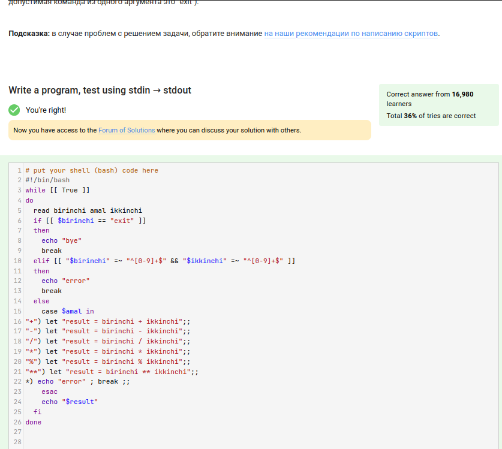{#fig:021 width=100%}

Скрипт:

`#!/bin/bash`

while [[ True ]]

do

  read birinchi amal ikkinchi

  if [[ $birinchi == "exit" ]]

  then

    echo "bye"

    break

  elif [[ "$birinchi" =~ "^[0-9]+$" && "$ikkinchi" =~ "^[0-9]+$" ]]

  then

    echo "error"

    break

  else

    case $amal in

"+") let "result = birinchi + ikkinchi";;

"-") let "result = birinchi - ikkinchi";;

"/") let "result = birinchi / ikkinchi";;

`"*") let "result = birinchi * ikkinchi";;`

`"%") let "result = birinchi % ikkinchi";;`

`"**") let "result = birinchi ** ikkinchi";;`

`*) echo "error" ; break ;;`

    `esac`

    `echo "$result"`

  `fi`

`done`

Данный скрипт является бесконечным циклом, который считывает три значения с помощью команды `read`: `birinchi`, `amal` и `ikkinchi`. 

Если значение `birinchi` равно "exit", выводится сообщение "bye" и цикл прерывается с помощью команды `break`.

В противном случае, происходит проверка условия с использованием оператора `if`. Если `birinchi` и `ikkinchi` являются числами (проверка осуществляется с использованием регулярных выражений), выводится сообщение "error" и цикл прерывается с помощью команды `break`.

В остальных случаях, выполняется блок `case`, где значение `amal` проверяется в соответствии с различными операциями (`+`, `-`, `/`, `*`, `%`, `**`). В зависимости от операции, выполняется соответствующий математический расчет, и результат записывается в переменную `result`. Затем результат выводится на экран.

Таким образом, скрипт продолжает запрашивать ввод операции и чисел до тех пор, пока пользователь не введет "exit" вместо `birinchi`, после чего скрипт завершается.

Вопрос: Пусть в директории /home/bi лежат файлы Star_Wars.avi, star_trek_OST.mp3, STARS.txt, stardust.mpeg, Eddard_Stark_biography.txt.

Отметьте все файлы, которые найдет команда find /home/bi -iname "star*", но НЕ найдет команда find /home/bi -name "star*"?(рис. @fig:022).

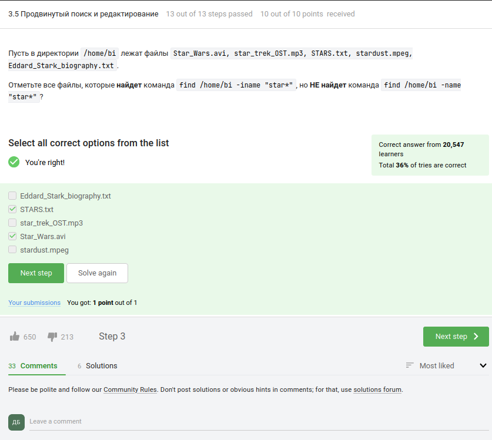{#fig:022 width=100%}

Команда `find /home/bi -iname "star*"` найдет все файлы, начинающиеся с "star" (независимо от регистра), включая файлы "Star_Wars.avi", "star_trek_OST.mp3", "STARS.txt", "stardust.mpeg" и "Eddard_Stark_biography.txt". 

Однако команда `find /home/bi -name "star*"` найдет только файлы, начинающиеся с "star" (с учетом регистра), исключая файлы, у которых первая буква в названии написана заглавной буквой. Поэтому она не найдет файлы "STARS.txt" и "Star_Wars.avi".

Вопрос: Задание на понимание работы опций -path и -name команды find. Отметьте все верные утверждения из перечисленных ниже.(рис. @fig:023).

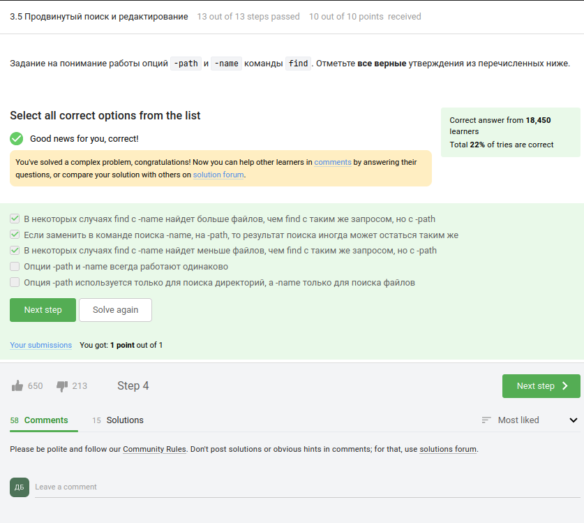{#fig:023 width=100%}

Верные утверждения:

- В некоторых случаях find с -name найдет больше файлов, чем find с таким же запросом, но с -path.

- Если заменить в команде поиска -name на -path, то результат поиска иногда может остаться таким же.

- В некоторых случаях find с -name найдет меньше файлов, чем find с таким же запросом, но с -path.

Объяснение:

- Опция -name ищет файлы и директории по имени, учитывая регистр.

- Опция -path ищет файлы и директории по полному пути, включая имя файла или директории, учитывая регистр.

Использование -name может привести к тому, что найдутся файлы, имя которых соответствует шаблону, но они могут находиться в поддиректориях, которые не удовлетворяют заданному пути. При использовании -path, результаты будут ограничены только файлами и директориями, полный путь которых соответствует заданному шаблону.

Таким образом, использование -path может привести к более точным и предсказуемым результатам поиска, особенно при необходимости поиска файлов и директорий в определенной структуре каталогов.

Вопрос: Предположим, что в директории /home/bi/ есть следующая структура файлов и поддиректорий:

/home/bi/
	dir1
    		file1 
    		dir2
        		file2
        		dir3
            			file3

Какие(ой) из трех файлов (file1, file2, file3) будут найдены по команде find /home/bi -mindepth 2 -maxdepth 3 -name "file*"?(рис. @fig:024).

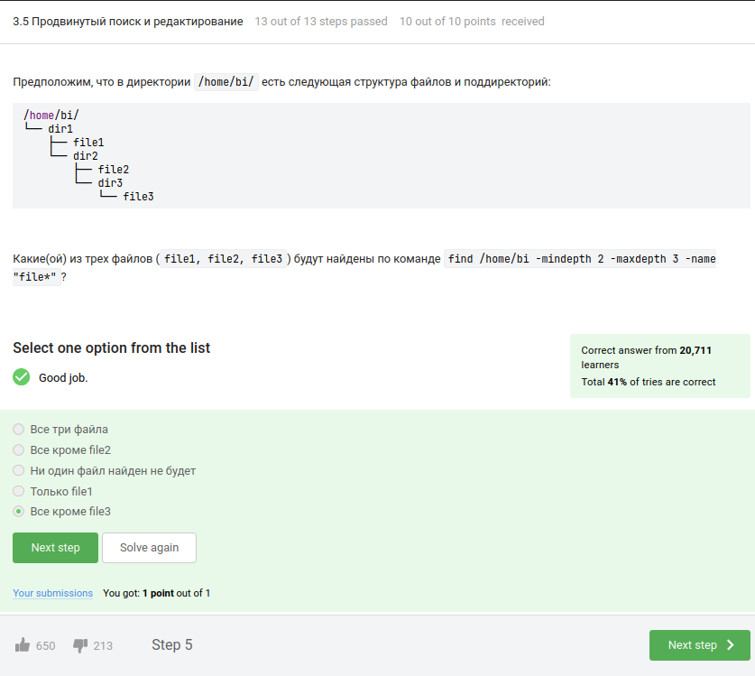{#fig:024 width=100%}

По команде `find /home/bi -mindepth 2 -maxdepth 3 -name "file*"` будут найдены два файла: file1 и file2.

Объяснение:

- `-mindepth 2` указывает, что поиск должен начинаться не сразу с `/home/bi/`, а с уровня 2, то есть с `/home/bi/dir1/` и `/home/bi/dir1/dir2/`.

- `-maxdepth 3` указывает, что поиск должен ограничиться уровнем 3, то есть `/home/bi/dir1/dir2/` и `/home/bi/dir1/dir2/dir3/`.

- `-name "file*"` указывает, что нужно искать файлы, имя которых начинается с "file".

Следовательно, команда найдет файлы file1 и file2, но не будет искать файлы в глубоко вложенной директории `/home/bi/dir1/dir2/dir3/`, поэтому файл file3 не будет найден.

Вопрос: Задание на понимание работы опций -A, -B и -C команды grep. Пусть у вас есть файл file.txt из 10 строк, причем в каждой строке есть слово "word". Если вы выполните на этом файле команды:

grep "word" file.txt > results.txt

grep -A 1 "word" file.txt > results.txt

grep -B 1 "word" file.txt > results.txt

grep -C 1 "word" file.txt > results.txt

то какая(ие) из них создаст файл results.txt наибольшего размера?(рис. @fig:025).

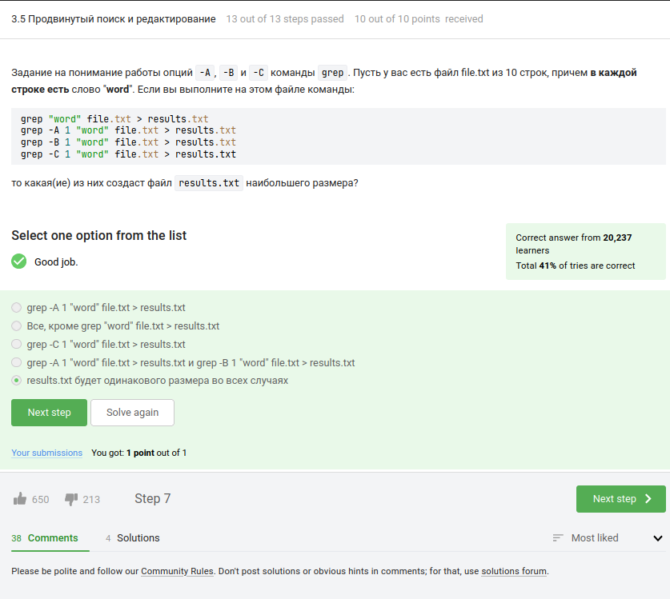{#fig:025 width=100%}

Правильный ответ: файл results.txt будет одинакового размера во всех случаях.

Объяснение:

- `grep "word" file.txt > results.txt` запишет в файл results.txt только строки, содержащие слово "word". Остальные строки будут исключены. Размер файла results.txt будет зависеть от количества строк, содержащих слово "word".

- `grep -A 1 "word" file.txt > results.txt` запишет в файл results.txt строки, содержащие слово "word", а также одну строку, следующую сразу после каждой найденной строки. Размер файла results.txt будет зависеть от количества строк, содержащих слово "word", плюс количество строк, которые следуют за каждой найденной строкой.

- `grep -B 1 "word" file.txt > results.txt` запишет в файл results.txt строки, содержащие слово "word", а также одну строку, предшествующую каждой найденной строке. Размер файла results.txt будет зависеть от количества строк, содержащих слово "word", плюс количество строк, которые предшествуют каждой найденной строке.

- `grep -C 1 "word" file.txt > results.txt` запишет в файл results.txt строки, содержащие слово "word", а также одну строку, как предшествующую, так и следующую после каждой найденной строки. Размер файла results.txt будет зависеть от количества строк, содержащих слово "word", плюс количество строк, которые предшествуют и следуют за каждой найденной строкой.

Во всех случаях результат записывается в один и тот же файл results.txt, поэтому его размер будет одинаковым.

Вопрос: Предположим, что в файле  text.txt записаны строки, показанные среди вариантов ответа. Отметьте только те из них, которые выведет на экран команда  grep -E "[xklXKL]?[uU]buntu$" text.txt.(рис. @fig:026).

![grep -E "[xklXKL]?[uU]buntu$" text.txt ](26.png){#fig:026 width=100%}

Все ответы верны. Команда `grep -E "[xklXKL]?[uU]buntu$" text.txt` будет искать строки в файле text.txt, которые соответствуют заданному регулярному выражению:

- The best OS is Xubuntu: строка соответствует `[xklXKL]?[uU]buntu$`, так как она начинается с "X" или "x", за которыми следует "ubuntu" с любыми буквами в верхнем или нижнем регистре.

- Linux is not always Ubuntu: строка не соответствует `[xklXKL]?[uU]buntu$`, так как не начинается ни с "X" или "x", ни с "K" или "k", но содержит слово "ubuntu" в середине.

- I prefer Kubuntu: строка соответствует `[xklXKL]?[uU]buntu$`, так как она начинается с "K" или "k", за которыми следует "ubuntu" с любыми буквами в верхнем или нижнем регистре.

- Lubuntu is better than Ubuntu: строка соответствует `[xklXKL]?[uU]buntu$`, так как она начинается с "L" или "l", за которыми следует "ubuntu" с любыми буквами в верхнем или нижнем регистре.

- Mac OS X, Windows, Ubuntu: строка не соответствует `[xklXKL]?[uU]buntu$`, так как не начинается ни с "X" или "x", ни с "K" или "k", и не содержит "ubuntu" в конце.

- Hmm, XKLubuntu: строка соответствует `[xklXKL]?[uU]buntu$`, так как она начинается с "X" или "x", за которыми следует "KLubuntu" с любыми буквами в верхнем или нижнем регистре, а затем "ubuntu" с любыми буквами в верхнем или нижнем регистре.

Таким образом, все строки, которые соответствуют регулярному выражению `[xklXKL]?[uU]buntu$`, будут найдены командой `grep -E "[xklXKL]?[uU]buntu$" text.txt`.

Вопрос: Что произойдет, если в команде sed -n `"/[a-z]*/p" text.txt` не указывать опцию -n?(рис. @fig:027).

![sed -n `"/[a-z]*/p" text.txt` ](27.png){#fig:027 width=100%}

Если не указать опцию `-n` в команде `sed -n "/[a-z]*/p" text.txt`, то на экран будет выведено всё содержимое файла `text.txt`. 

По умолчанию `sed` выводит каждую строку после обработки. Опция `-n` подавляет этот стандартный вывод, и поэтому без неё все строки будут напечатаны на экран. 

С учетом регулярного выражения `/[a-z]*/p`, команда `sed` будет искать строки, содержащие одну или более маленьких букв латинского алфавита, и печатать их на экран. Таким образом, без опции `-n` каждая строка, удовлетворяющая данному регулярному выражению, будет выведена дважды: сначала в результате обработки `sed`, а затем в стандартный вывод.

Вопрос: Запишите в форму ниже инструкцию sed, которая заменит все "аббревиатуры" в файле input.txt на слово "abbreviation" и запишет результат в файл edited.txt (на экран при этом ничего выводить не нужно). Обратите внимание, что в инструкции должны быть указаны и сам sed, и оба файла!

Под "аббревиатурой" будем понимать слово, которое удовлетворяет следующим условиям: 

состоит только из больших букв латинского алфавита,
состоит из хотя бы двух букв,
окружено одним пробелом с каждой стороны.
При этом будем считать, что в тексте не может быть две "аббревиатуры" подряд. Например, текст  " YOU YOU and YOU!" является некорректным (в нем есть две "аббревиатуры", но они идут подряд) и на таких примерах мы проверять вашу инструкцию не будем.

Пример: если у вас был текст "Hi, I heard these songs by ABBA, TLA and DM !", то он должен быть преобразован в "Hi, I heard these songs by ABBA, abbreviation and abbreviation !".(рис. @fig:028).

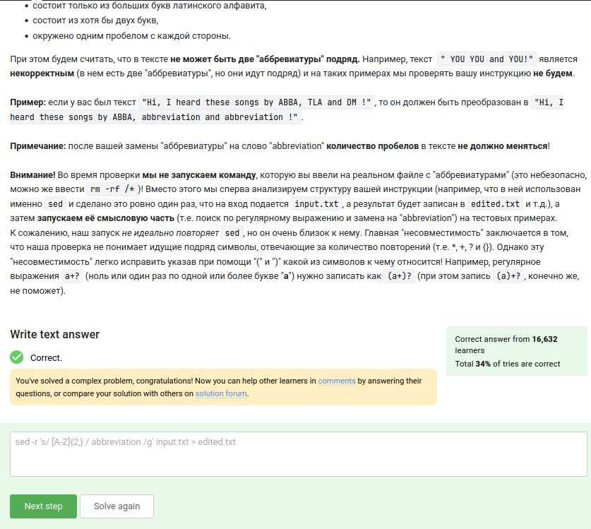{#fig:028 width=100%}

Инструкция sed 

sed -r 's/ [A-Z]{2,} / abbreviation /g' input.txt > edited.txt

Вопрос: Какую опцию нужно указать при запуске gnuplot, чтобы при его закрытии не были автоматически закрыты и все нарисованные в нём графики?(рис. @fig:029).

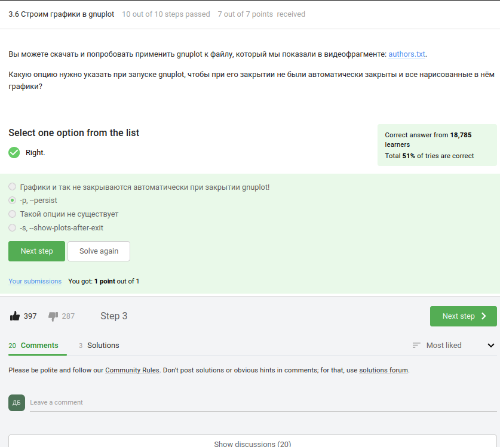{#fig:029 width=100%}

Правильный ответ на этот вопрос - --persist или -p. При указании этой опции при запуске gnuplot, окно с графиком останется открытым после завершения скрипта или команды, позволяя вам продолжать работу с графиками или взаимодействовать с ними.

Вопрос: Предположим у вас есть файл data.csv с двумя столбцами по 10 чисел в каждом. В первой строке не записаны названия столбцов, т.е. ряды данных начинаются прямо с первой строки. Вы запускаете gnuplot и вводите в него две команды:

set key autotitle columnhead

plot 'data.csv' using 1:2

Какое в этом случае будет название у построенного ряда данных и сколько будет нарисовано точек на графике?(рис. @fig:030).

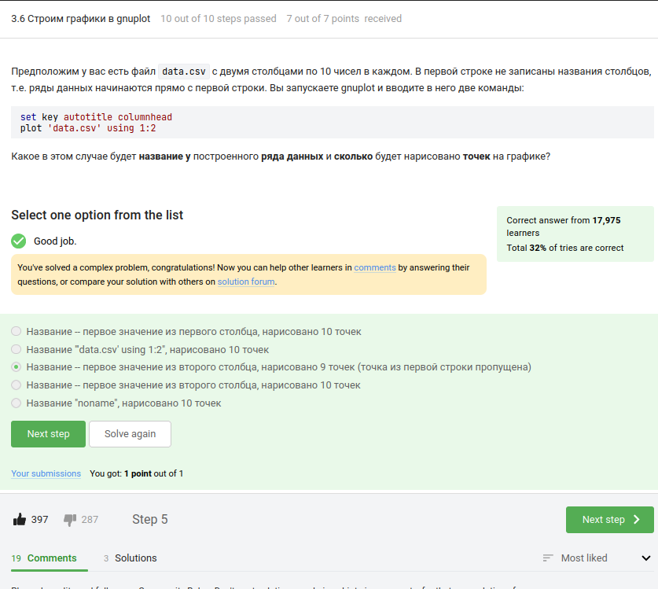{#fig:030 width=100%}

Если в файле `data.csv` первая строка не содержит названий столбцов, то с использованием команды `set key autotitle columnhead` в gnuplot будет использовано автоматическое название для ряда данных. Автоматическое название будет взято из первой строки данных в файле `data.csv`, которая будет интерпретирована как заголовок столбцов.

В данном случае, название ряда данных будет взято из первого столбца данных, и количество нарисованных точек на графике будет равно количеству строк данных за исключением первой строки, то есть 9 точек.

Вопрос: Предположим, что вы пишите gnuplot-скрипт и у вас в нем есть три переменные x1, x2, x3, в которых записаны координаты важных точек по оси ОХ (по возрастанию). Вы хотите, чтобы на этой оси было только три деления (т.е. три черточки) в этих самых координатах, а подписи этих делений были оформлены в виде "point <номер точки>, value <значение соответствующей переменной>".
Например, для x1=0, x2=10, x3=20, это были бы надписи "point 1, value 0" в точке с координатой 0 по горизонтали,  "point 2, value 10" в точке с координатой 10 и  "point 3, value 20" в точке с координатой 20.
Или, например,  x1=100, x2=150, x3=250, это были бы надписи "point 1, value 100" в точке с координатой 100, "point 2, value 150" в точке с координатой 150 и "point 3, value 250" в точке с координатой 250. 

Впишите в форму ниже одну команду (т.е. одну строку), которую нужно добавить в скрипт, для выполнения этой задачи.(рис. @fig:031).

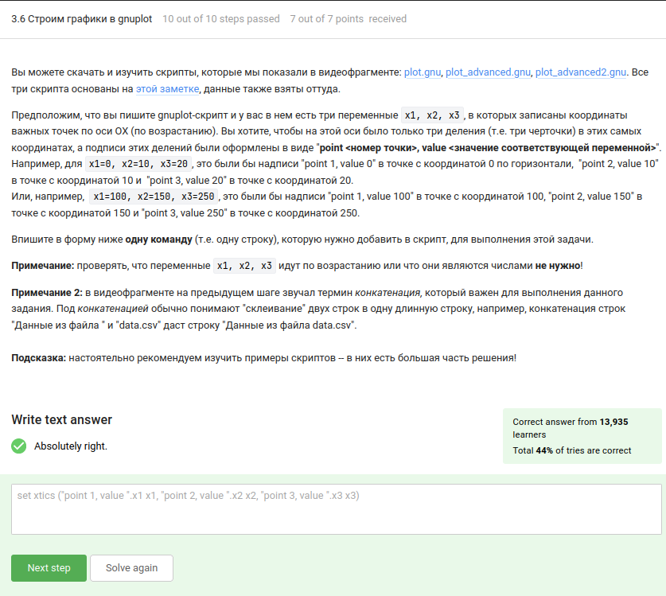{#fig:031 width=100%}

Необходимая команда: set xtics ("point 1, value ".x1 x1, "point 2, value ".x2 x2, "point 3, value ".x3 x3)

В данном скрипте используется команда `set xtics`, которая устанавливает деления и подписи на оси OX (горизонтальной оси). С помощью выражения в скобках и указанных переменных x1, x2 и x3 формируются подписи для каждого деления. Каждая подпись состоит из строки "point <номер точки>, value " и значения соответствующей переменной x1, x2 или x3. Значения переменных x1, x2 и x3 добавляются к подписям с помощью оператора конкатенации ".", чтобы создать полные строки для подписей делений.

Задание: Если вы не скачали на предыдущем шаге файлы animated.gnu и move.rot, то скачайте их теперь, т.к. они понадобятся для выполнения задания. Указанные файлы использовались в последнем видеофрагменте для создания вращающегося графика. Измените инструкции в файле move.rot (т.е. добавлять и удалять инструкции нельзя!) таким образом, чтобы:

График отразился зеркально относительно горизонтальной поверхности. То есть там, где была точка (10, 10, 200), станет точка (10, 10, -200), где была точка  (-10, -10, 200) станет (-10, -10, -200) и т.д. При этом точка (0, 0, 0) останется на месте.

Изображение стало вращаться в обратную сторону. То есть если раньше вращалось "влево", то теперь станет "вправо".
Вращение стало в два раза быстрее. То есть станет в два раза больше перерисовок графика на каждую секунду вращения.
Измененный файл загрузите в форму ниже.(рис. @fig:032).

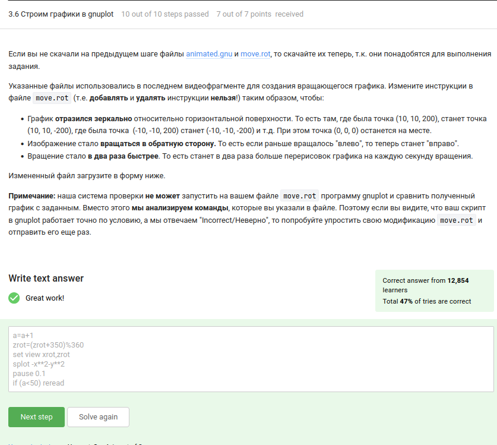{#fig:032 width=100%}

a=a+1

Счетчик длительности вращения.

zrot=(zrot+10)%360

Задается угол поворота графика функции.

set view xrot,zrot

Задается угол, под которым будет изображаться график функции.

`splot x**2+y**2`

Команда splot указывает на то, что нужно рисовать двухмерную проекцию функции.

pause 5

Устанавливается задержка.

if (a<50) reread

Если счетчик длительности не равен 50, то с помощью команды reread чтение файла начинается сначала.

Вопрос: Какая команда(ы) установят файлу file.txt права доступа rwxrw-r--, если изначально у него были права r--r--r--. Укажите все верные варианты ответа!(рис. @fig:033).

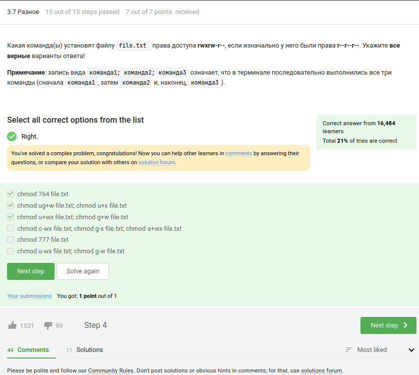{#fig:033 width=100%}

Верные ответы:

1. `chmod 764 file.txt`: Эта команда устанавливает права доступа для файла `file.txt` в режиме rwxrw-r--, где "r" представляет чтение (read), "w" представляет запись (write) и "x" представляет выполнение (execute). Цифры 764 представляют комбинацию прав доступа для пользователя, группы и остальных, где 7 соответствует rwx, 6 соответствует rw- и 4 соответствует r--.

2. `chmod ug+w file.txt; chmod u+x file.txt`: Эта команда выполняет две отдельные команды. Первая команда `chmod ug+w file.txt` устанавливает запись (write) для пользователя (u) и группы (g) для файла `file.txt`. Вторая команда `chmod u+x file.txt` устанавливает выполнение (execute) только для пользователя (u) для файла `file.txt`.

3. `chmod u+wx file.txt; chmod g+w file.txt`: Эта команда также выполняет две отдельные команды. Первая команда `chmod u+wx file.txt` устанавливает чтение (read), запись (write) и выполнение (execute) для пользователя (u) для файла `file.txt`. Вторая команда `chmod g+w file.txt` устанавливает запись (write) для группы (g) для файла `file.txt`.

Все три варианта ответа достигают того же результата и устанавливают требуемые права доступа для файла `file.txt`.

Вопрос: Предположим вы использовали команду sudo для создания директории dir. По умолчанию для dir были выставлены права доступа rwxr-xr-x (владелец root, группа root). Таким образом никто кроме пользователя root не может ничего записывать в эту директорию, например, не может создавать файлы в ней. 

После выполнения какой команды user из группы group всё-таки сможет создать файл внутри dir? Укажите все верные варианты ответов!(рис. @fig:034).

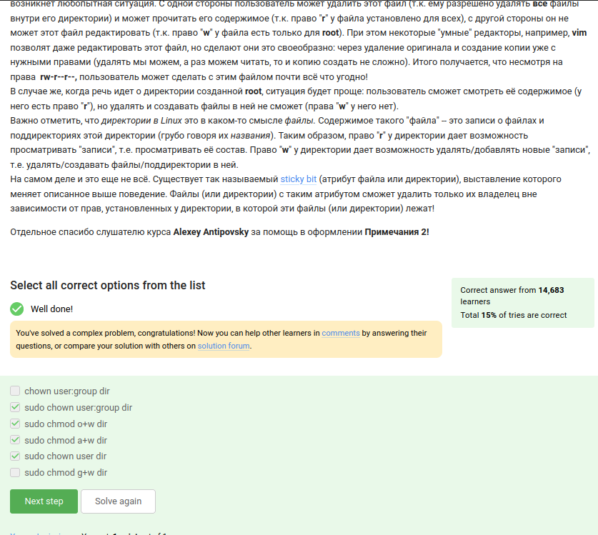{#fig:034 width=100%}

Верные ответы:

1. `sudo chown user:group dir` - Изменение владельца и группы директории dir на user:group позволит пользователю user, находящемуся в группе group, создавать файлы внутри этой директории. После изменения владельца и группы, пользователи, принадлежащие к этой группе, получат необходимые права на запись в директорию.

2. `sudo chmod o+w dir` - Добавление права на запись для "других" (others) позволит любому пользователю создавать файлы внутри директории dir, независимо от принадлежности к определенной группе. 

3. `sudo chmod a+w dir` - Добавление права на запись для всех (владелец, группа и другие) позволит любому пользователю, включая пользователя user из группы group, создавать файлы внутри директории dir. 

4. `sudo chown user dir` - Изменение владельца директории dir на user не даст возможности другим пользователям, включая пользователей из группы group, создавать файлы внутри этой директории. Это изменение только установит пользователя user в качестве владельца, но не изменит права доступа для группы или других пользователей.

Вопрос: Отметьте какие характеристики файла можно посчитать с использованием команды wc.(рис. @fig:035).

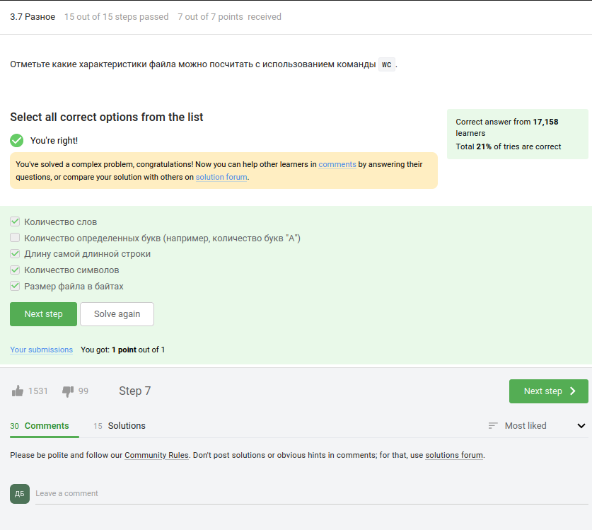{#fig:035 width=100%}

Верные ответы:
1. Количество слов - команда `wc` может подсчитать общее количество слов в файле. При использовании `wc -w` будет выведено только количество слов.

2. Длина самой длинной строки - команда `wc` может определить длину самой длинной строки в файле. При использовании `wc -L` будет выведена длина самой длинной строки.

3. Количество символов - команда `wc` может подсчитать общее количество символов в файле. При использовании `wc -m` будет выведено только количество символов.

4. Размер файла в байтах - команда `wc` может вывести размер файла в байтах. При использовании `wc -c` будет выведен размер файла в байтах.

Команда `wc` предоставляет различные опции для подсчета различных характеристик файла, и эти четыре опции являются наиболее распространенными.

Вопрос: Впишите в форму ниже команду, которая выведет сколько места на диске занимает текущая директория (при этом размер нужно вывести в удобном для чтения формате (например, вместо 2048 байт надо выводить 2.0К) и больше на экран выводить ничего не нужно). В команде указывайте только необходимые для выполнения задания опции и аргументы, лишних опций указывать не нужно!(рис. @fig:036).

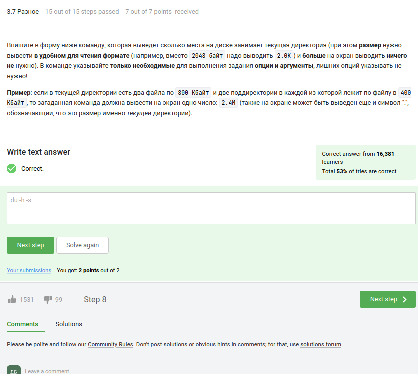{#fig:036 width=100%}

Для вывода размера текущей директории в удобном формате можно использовать команду du с опцией -sh.

Опция -s используется для вывода только общего размера текущей директории, а опция -h преобразует размер в удобный для чтения формат, например, К для килобайт, М для мегабайт и т.д. Эта команда выведет только размер текущей директории в удобном формате, без вывода лишней информации.

Вопрос: Впишите в форму ниже максимально короткую команду (т.е. в которой минимально возможное число символов), которая позволит создать в текущей директории 3 поддиректории с именами dir1, dir2, dir3. 

Если вы придумали команду, которая выполняет эту задачу, а система проверки сообщает вам "Incorrect"/"Неверно", то скорее всего вы придумали не самую короткую команду из возможных!(рис. @fig:037).

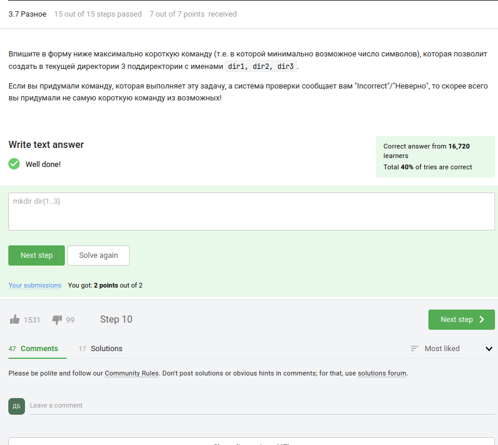{#fig:037 width=100%}

В данной команде используется фигурные скобки и диапазон чисел {1..3} для создания поддиректорий с именами dir1, dir2 и dir3. Это самая короткая команда, которая достаточна для выполнения данной задачи.

# Вывод

В ходе лабораторной работы мы познакомились с операционной системой Linux и основами её использования. В рамках курса установили Linux на компьютер, познакомились с программами в нем, поработали в терминале, зайшли на удаленный сервер и рассмотрели еще несколько продвинутых тем. Стоит отметить, что курс не является исчерпывающим и рассказывает только о базовых возможностях Linux, но, несмотря на это, рассказанного материала достаточно для успешного выполнения разноплановых задач в системе Linux.
